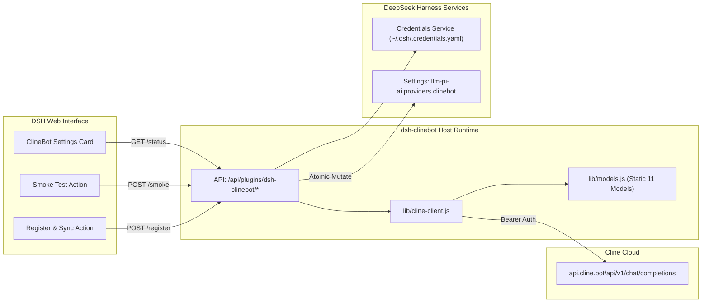

# 📦 @goodandready/dsh-clinebot

<div align="center">

<h3>Native ClineBot / ClinePass Provider Companion for DeepSeek Harness</h3>

<p align="center">
  <a href="https://www.npmjs.com/package/@goodandready/dsh-clinebot"></a>
  <a href="LICENSE"></a>
  <a href="https://github.com/topics/dsh-plugin"></a>
  <a href="https://nodejs.org"></a>
</p>

<!-- Author Showcase Link -->
<p align="center">
  <a href="https://goodandready.app/"></a>
</p>

<p align="center">
  <a href="README.md"><b>🇬🇧 English</b></a> •
  <a href="README.ru.md"><b>🇷🇺 Русский</b></a> •
  <a href="README.zh.md"><b>🇨🇳 中文说明</b></a>
</p>

</div>

---

## ⚡ Overview & The Problem

**ClinePass** (`https://cline.bot`) is a flat-rate subscription service providing developers with 2–5x higher rate limits across premier open-weights coding and reasoning models through a single OpenAI-compatible endpoint (`https://api.cline.bot/api/v1`).

However, integrating ClinePass into DeepSeek Harness (DSH) natively encounters key hurdles:
1. **No `/v1/models` Discovery**: `GET /v1/models` on `api.cline.bot` returns `404 Not Found`. Dynamic discovery fails silently or leaves the provider with 0 models.
2. **Model Identifier Formats**: Models require the specific prefix `cline-pass/` (e.g. `cline-pass/deepseek-v4-flash`, `cline-pass/kimi-k3`).
3. **Credential Security**: Storing API keys directly in plain settings is a security antipattern.

**`@goodandready/dsh-clinebot`** solves all these challenges:
* 🎯 Provides an official, pre-curated static catalogue of all 11 ClinePass models.
* 🔐 Safely resolves keys from DSH credentials (`~/.dsh/.credentials.yaml`) without leaking secrets into settings.
* 🔄 One-click registration directly into DSH's `llm-pi-ai` provider registry.
* 🩺 Built-in live latency and Smoke Test chat completions directly from the Settings UI.

---

## 🏛️ Architecture



---

## ✨ Features & Module Breakdown

* **`lib/models.js`**:
  Defines the curated ClinePass catalogue with context window sizes (200k tokens), token limits, and input modalities (`text` and `vision`).
* **`lib/cline-client.js`**:
  Normalizes base URLs, formats the `llm-pi-ai` provider object (`api: 'openai-completions'`), executes network health probes, and performs non-streaming smoke chat completions (`max_tokens: 8`) to measure endpoint latency.
* **`lib/index.js`**:
  Cordis service module that injects `['settings', 'webServer', 'credentials']`, manages schema persistence, and exposes REST endpoints.
* **`lib/client.js`**:
  Zero-build native UI registered in the `settings.plugin.item` and `settings.section` slots, featuring health badges, interactive model selectors, and live smoke test response previews.

---

## 📦 Installation

Install into your active DeepSeek Harness profile:

```bash
dsh plugin --profile web add @goodandready/dsh-clinebot
```

Or for local development:
```bash
pnpm add /path/to/dsh-clinebot
```

---

## 🔑 Credential Configuration

Add your ClinePass API key to your DSH credentials file (`~/.dsh/.credentials.yaml`):

```yaml
CLINEBOT_API_KEY: "your-clinepass-api-key"
```

Or export it in your environment:
```bash
export CLINEBOT_API_KEY="your-clinepass-api-key"
```

---

## ⚙️ Configuration Reference (`settings.yaml`)

```yaml
dsh-clinebot:
  enabled: true
  baseUrl: https://api.cline.bot/api/v1
  apiKeyEnv: CLINEBOT_API_KEY
  defaultModel: cline-pass/deepseek-v4-flash
  timeoutMs: 15000
  smokeTimeoutMs: 25000
  enabledModels:
    - cline-pass/deepseek-v4-flash
    - cline-pass/deepseek-v4-pro
    - cline-pass/glm-5.2
    - cline-pass/kimi-k3
    - cline-pass/kimi-k2.7-code
    - cline-pass/kimi-k2.6
    - cline-pass/qwen3.7-max
    - cline-pass/qwen3.7-plus
    - cline-pass/minimax-m3
    - cline-pass/mimo-v2.5
    - cline-pass/mimo-v2.5-pro
```

| Parameter | Type | Default | Description |
|---|---|---|---|
| `enabled` | `boolean` | `true` | Enables or disables the ClineBot companion plugin. |
| `baseUrl` | `string` | `https://api.cline.bot/api/v1` | Base OpenAI-compatible URL for ClinePass. |
| `apiKeyEnv` | `string` | `CLINEBOT_API_KEY` | Credential reference name (never put plain keys here). |
| `defaultModel` | `string` | `cline-pass/deepseek-v4-flash` | Default model used for initial chat and smoke tests. |
| `enabledModels` | `string[]` | *All 11 models* | Subset of ClinePass models exposed in DSH. |
| `timeoutMs` | `number` | `15000` | Network probe timeout in milliseconds. |
| `smokeTimeoutMs`| `number` | `25000` | Chat completion smoke test timeout in milliseconds. |

---

## 🔌 HTTP API Reference

All plugin endpoints are mounted under `/api/plugins/dsh-clinebot`:

* **`GET /status`**: Returns health, key resolution status, and active models list.
* **`POST /register`**: Registers or updates the provider within DSH `llm-pi-ai`.
* **`POST /unregister`**: Safely removes the provider entry from DSH `llm-pi-ai`.
* **`POST /smoke`**: Executes a ping chat completion and returns latency and preview text.
* **`POST /models`**: Updates the enabled models list in plugin settings.

---

## 📄 License

MIT © [GooDAnDReaDY](https://github.com/GooDAnDReaDY)
