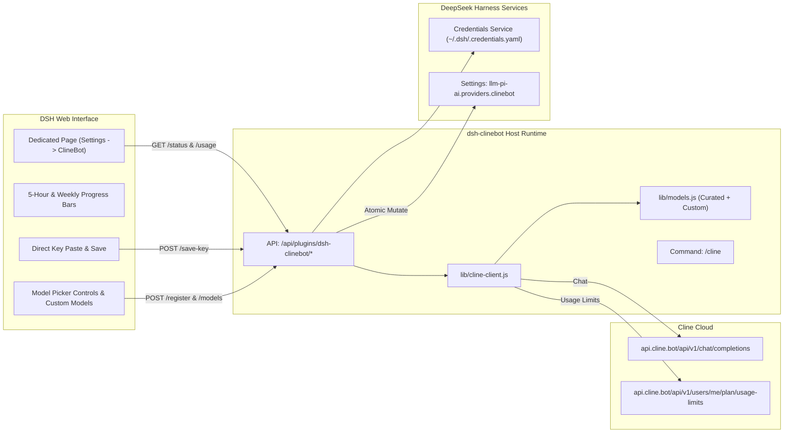

# 📦 @goodandready/dsh-clinebot

<div align="center">

<h3>Native ClineBot / ClinePass Provider Companion for DeepSeek Harness</h3>

<p align="center">
  <a href="https://www.npmjs.com/package/@goodandready/dsh-clinebot"></a>
  <a href="LICENSE"></a>
  <a href="https://github.com/topics/dsh-plugin"></a>
  <a href="https://nodejs.org"></a>
</p>

<!-- Author Showcase Link -->
<p align="center">
  <a href="https://goodandready.app/"></a>
</p>

<p align="center">
  <a href="README.md"><b>🇬🇧 English</b></a> •
  <a href="README.ru.md"><b>🇷🇺 Русский</b></a> •
  <a href="README.zh.md"><b>🇨🇳 中文说明</b></a>
</p>

</div>

---

## ⚡ Overview & The Problem

**ClinePass** (`https://cline.bot`) is a flat-rate subscription service ($9.99/mo) providing developers with 2–5x higher rate limits across premier open-weights coding and reasoning models through a single OpenAI-compatible endpoint (`https://api.cline.bot/api/v1`).

Integrating ClinePass into DeepSeek Harness (DSH) natively poses key challenges:
1. **No `/v1/models` Discovery**: `GET /v1/models` on `api.cline.bot` returns `404 Not Found`. Dynamic discovery fails silently or leaves the provider with 0 models.
2. **Model Identifier Formats**: Models require the specific prefix `cline-pass/` (e.g. `cline-pass/deepseek-v4-flash`, `cline-pass/kimi-k3`).
3. **Quota Tracking**: Rolling 5-hour and weekly limits need clear in-browser visualization.
4. **Credential Security**: Storing API keys directly in plain settings is insecure.

**`@goodandready/dsh-clinebot`** provides a complete solution:
* 🖥️ **Dedicated Settings Page**: Full-width page in DSH Settings (`Settings → ClineBot`).
* 📊 **Live Quota Dashboard**: Visual progress bars for 5-hour rolling limits and weekly windows from the official `GET /users/me/plan/usage-limits` API.
* 🔑 **In-UI Key Storage**: Paste your API key directly in the UI; it is saved securely via `ctx.credentials.set()` into `~/.dsh/.credentials.yaml`.
* 🎯 **Model Picker Management**: Granular checkboxes to choose which models appear in the chat picker.
* ➕ **Add Custom Models**: Add newly released ClinePass models directly from the UI without waiting for plugin updates.
* 💬 **Slash-Command `/cline`**: Check quota, limits, latency, and active model directly from the DSH chat console.

---

## 🏛️ Architecture



---

## ✨ Features & Module Breakdown

* **`lib/models.js`**:
  Manages the curated catalog (11 built-in models) and user-added custom models (`getAllModels`, `validateCustomModel`).
* **`lib/cline-client.js`**:
  * `fetchUsageLimits`: queries `GET /users/me/plan/usage-limits` and `GET /users/me` with in-memory caching.
  * `saveCredentialKey`: writes credentials directly into `~/.dsh/.credentials.yaml`.
  * `smokeChat`: tests latency via non-streaming ping.
  * `buildPiAiProvider`: builds the DSH `llm-pi-ai` structure (`api: 'openai-completions'`).
* **`lib/index.js`**:
  Cordis service module managing routes, credentials, and registering the `/cline` slash command.
* **`lib/client.js`**:
  Full-featured dedicated Settings section (`settings.section`, order 28) and plugin accordion (`settings.plugin.item`).

---

## 📦 Installation

```bash
dsh plugin --profile web add @goodandready/dsh-clinebot
```

---

## 💬 Slash-Command `/cline`

From any DSH chat session, type `/cline` to inspect quota:

```text
### 🤖 ClinePass Status (ClinePass ($9.99/mo))
* Пинг хоста: ✅ 210 мс
* Активный ключ: CLINEBOT_API_KEY (credentials)
* Модель по умолчанию: `cline-pass/deepseek-v4-flash`

⏱ 5-часовое окно: [████░░░░░░] 42% (сброс: 18:00)
📅 Недельное окно: [██████░░░░] 60% (сброс: 08.09)
* Аккаунт: `developer@example.com`
```

---

## ⚙️ Configuration Reference (`settings.yaml`)

```yaml
dsh-clinebot:
  enabled: true
  baseUrl: https://api.cline.bot/api/v1
  apiKeyEnv: CLINEBOT_API_KEY
  defaultModel: cline-pass/deepseek-v4-flash
  timeoutMs: 15000
  smokeTimeoutMs: 25000
  enabledModels:
    - cline-pass/deepseek-v4-flash
    - cline-pass/deepseek-v4-pro
    - cline-pass/kimi-k3
    - cline-pass/qwen3.7-max
  customModels: []
```

---

## 📄 License

MIT © [GooDAnDReaDY](https://github.com/GooDAnDReaDY)
