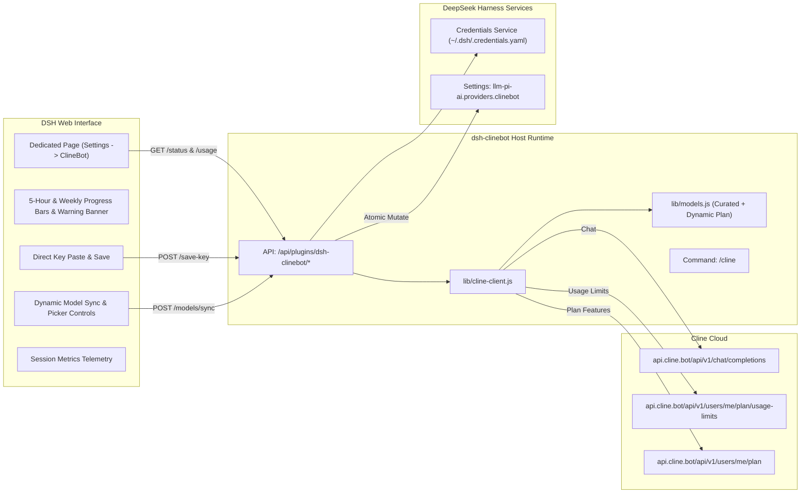

# 📦 @goodandready/dsh-clinebot

<div align="center">

<h3>Native ClineBot / ClinePass Provider Companion for DeepSeek Harness</h3>

<p align="center">
  <a href="https://www.npmjs.com/package/@goodandready/dsh-clinebot"></a>
  <a href="LICENSE"></a>
  <a href="https://github.com/topics/dsh-plugin"></a>
  <a href="https://nodejs.org"></a>
</p>

<!-- Author Showcase Link -->
<p align="center">
  <a href="https://goodandready.app/"></a>
</p>

<p align="center">
  <a href="README.md"><b>🇬🇧 English</b></a> •
  <a href="README.ru.md"><b>🇷🇺 Русский</b></a> •
  <a href="README.zh.md"><b>🇨🇳 中文说明</b></a>
</p>

<table align="center">
  <tr>
    <td align="center">
      ⭐ <strong>If you like this plugin, please star it on GitHub</strong> — it shows me that the plugin is useful to you and motivates me to keep developing it.
      <br><br>
      🐛 <strong>If you find a bug or would like to request a feature</strong>, open a GitHub issue in any language — I will review your proposal and implement useful suggestions in a future plugin version.
    </td>
  </tr>
</table>

</div>

---

## ⚡ Overview & The Problem

**ClinePass** (`https://cline.bot`) is a subscription service providing developers with 2–5x higher rate limits across premier open-weights coding and reasoning models through a single OpenAI-compatible endpoint (`https://api.cline.bot/api/v1`).

Integrating ClinePass into DeepSeek Harness (DSH) natively poses key challenges:
1. **No `/v1/models` Discovery**: `GET /v1/models` on `api.cline.bot` returns `404 Not Found`. Dynamic discovery fails silently or leaves the provider with 0 models.
2. **Model Identifier Formats**: Models require the specific prefix `cline-pass/` (e.g. `cline-pass/deepseek-v4-flash`, `cline-pass/kimi-k3`).
3. **Quota Tracking**: Rolling 5-hour and weekly limits need clear in-browser visualization.
4. **Credential Security**: Storing API keys directly in plain settings is insecure.

**`@goodandready/dsh-clinebot`** provides a complete solution:
* 🚀 **One-Click In-App Updater**: Upgrade `@goodandready/dsh-clinebot` directly from the DSH UI or trigger secure loopback updates via `/dsh-clinebot/update`.
* ⚡ **SWR Quota & Health Caching**: Instantaneous response time (<2ms) on status queries with background revalidation.
* 🔀 **Smart Quota-Aware Failover**: Automatic multi-account rotation on stream HTTP 429 and exhausted quota (with 30s storm protection; current request is not retried, subsequent chat requests use the next available account).
* 🖥️ **Plugin configuration page**: Open the installed ClineBot plugin and choose configure. The page shows the credential name, models, quota, and accounts. It is not a separate sidebar section.
* 🔄 **Dynamic Subscription Model Sync**: Automatically pulls real models included in your ClinePass plan directly from `GET /api/v1/users/me/plan` with one-click DSH provider sync. Only actual plan models are registered in DSH, while the built-in catalog serves as a rich properties reference and fallback when unsynced.
* ⚠️ **Quota Exhaustion Alerts**: Real-time visual warning banners when 5-hour rolling limit reaches 80% (warning) and 95% (exhausted), complete with countdown to reset.
* 📈 **Session Metrics Telemetry**: Live dashboard tracking real in-flight DSH chat requests through the ClineBot provider, prompt and completion tokens, stream latency, and error counts since process startup.
* 📊 **Live Quota Dashboard**: Visual progress bars for 5-hour rolling limits and weekly windows from the official `GET /users/me/plan/usage-limits` API.
* 🔑 **In-UI Key Storage**: Paste your API key directly in the UI; it is saved securely via `ctx.credentials.set()` into `~/.dsh/.credentials.yaml`.
* 🎯 **Model Picker Management**: Granular checkboxes to choose which models appear in the chat picker.
* 💬 **Slash-Command `/cline`**: Check quota, limits, warnings, session metrics, latency, and active model directly from the DSH chat console.

---

## 🏛️ Architecture



---

## ✨ Features & Module Breakdown

* **`lib/models.js`**:
  Manages the curated catalog (11 built-in models) with full reasoning effort mappings (`off: null`, `low`, `medium`, `high`, `max`), upstream 200k context limit declarations, and dynamic subscription plan model parsing (`parsePlanIncludedModels`, `getAllModels`, `getDynamicModels`).
* **`lib/cline-client.js`**:
  * `fetchUsageLimits`: queries `GET /users/me/plan/usage-limits`, `GET /users/me/plan`, and `GET /users/me` with in-memory caching.
  * `sessionStats` / `recordSessionRequest`: in-memory telemetry recording requests count, tokens, latency, and timestamps.
  * `saveCredentialKey`: writes credentials directly into `~/.dsh/.credentials.yaml`.
  * `smokeChat`: tests latency via non-streaming ping and updates session metrics.
  * `buildPiAiProvider`: builds the DSH `llm-pi-ai` structure (`api: 'openai-completions'`) with full reasoning effort protocol compliance (`compat.supportsReasoningEffort: true`).
* **`lib/index.js`**:
  Cordis service module managing routes (including `POST /dsh-clinebot/models/sync`), quota warnings threshold evaluation, credentials, and registering the `/cline` slash command.
* **`lib/client.js`**:
  Configuration page on the plugin row (`plugins.row.config`) with live quota bars, an exhaustion warning, session metrics, one-click plan sync, and a fallback plugins card (`settings.plugin.item`). There is no `settings.section` sidebar entry.

---

## 📦 Installation

```bash
dsh plugin --profile web add @goodandready/dsh-clinebot
```

Restart your DeepSeek Harness instance and refresh the browser.

---

## 💬 Slash-Command `/cline`

From any DSH chat session, type `/cline` to inspect quota, warning alerts, and session telemetry:

```text
### 🤖 ClinePass Status (ClinePass)
* Latency: ✅ 210 ms
* Active Key: CLINEBOT_API_KEY (credentials)
* Default Model: `cline-pass/deepseek-v4-flash`

⏱ 5-Hour Window: [████░░░░░░] 42% (resets: 18:00)
📅 Weekly Window: [██████░░░░] 60% (resets: Sep 8)
* Account: `developer@example.com`

📈 Session Metrics:
* Requests: 14 calls
* Tokens: ~8,450 (Prompt: 6,100 | Completion: 2,350)
* Last Latency: 210 ms
```

---

## ⚙️ Configuration Reference (`settings.yaml`)

Configure options in `settings.yaml` or directly inside the Web UI:

```yaml
dsh-clinebot:
  enabled: true
  baseUrl: https://api.cline.bot/api/v1
  apiKeyEnv: CLINEBOT_API_KEY
  defaultModel: cline-pass/deepseek-v4-flash
  timeoutMs: 15000
  smokeTimeoutMs: 25000
  enabledModels:
    - cline-pass/deepseek-v4-flash
    - cline-pass/deepseek-v4-pro
    - cline-pass/kimi-k3
    - cline-pass/qwen3.7-max
  dynamicModels: []
```

### Configuration Parameters

| Parameter | Type | Default | Description |
|:---|:---|:---|:---|
| `enabled` | `boolean` | `true` | Enable or disable the ClineBot provider bridge |
| `baseUrl` | `string` | `"https://api.cline.bot/api/v1"` | ClinePass OpenAI-compatible base URL |
| `apiKeyEnv` | `string` | `"CLINEBOT_API_KEY"` | Environment variable / credentials key name |
| `defaultModel` | `string` | `"cline-pass/deepseek-v4-flash"` | Default selected model ID |
| `timeoutMs` | `number` | `15000` | HTTP request timeout in milliseconds |
| `smokeTimeoutMs` | `number` | `25000` | Smoke test latency ping timeout |
| `enabledModels` | `array` | `[...]` | List of models exposed in the DSH chat picker |
| `dynamicModels` | `array` | `[]` | Dynamic models automatically synced from the official plan |

---

## 🌐 HTTP API Endpoints

All endpoints are registered under `/dsh-clinebot/*` and protected against untrusted cross-site origins (same-origin and loopback allowed):

* `GET /dsh-clinebot/status` — Live status report including provider health, active credential, quota, and session metrics.
* `GET /dsh-clinebot/config` — Diagnostic endpoint returning public configuration without secret keys.
* `PUT /dsh-clinebot/config` — Update configuration fields. Accepts only known schema properties (unknown fields or deprecated `enabledModels` return `400 Bad Request`).
* `POST /dsh-clinebot/key/verify` — Validates a candidate API key against `api.cline.bot` and returns account email and plan name.
* `POST /dsh-clinebot/save-key` — Saves a key into DSH credentials service under a valid `CLINEBOT_API_KEY*` name.
* `POST /dsh-clinebot/models/sync` — Synchronizes models with your active subscription plan.
* `POST /dsh-clinebot/models/toggle` — Toggles models via `disabledModels`.
* `POST /dsh-clinebot/accounts/active` — Pins an active account from the account pool.
* `POST /dsh-clinebot/smoke` — Runs a live latency test ping.

---

## 🧪 Testing

Run the automated test suite:

```bash
npm test
```

---

## 📄 License

MIT © [GooDAnDReaDY](https://github.com/GooDAnDReaDY)
