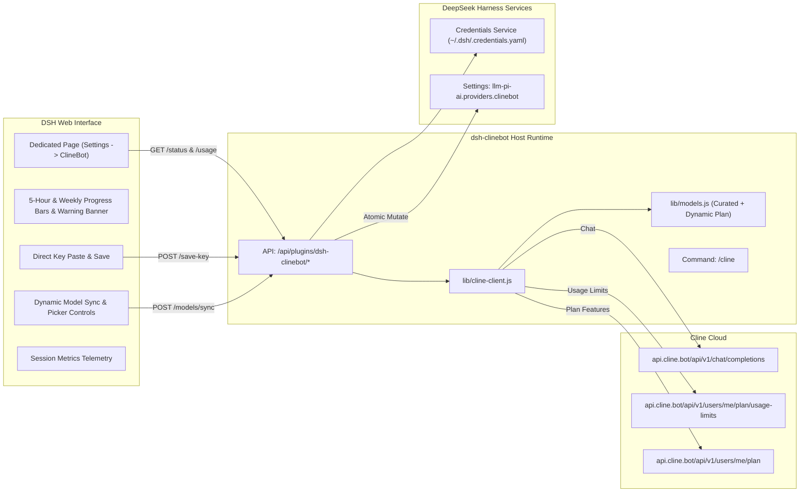

# 📦 @goodandready/dsh-clinebot

<div align="center">

<h3>Native ClineBot / ClinePass Provider Companion for DeepSeek Harness</h3>

<p align="center">
  <a href="https://www.npmjs.com/package/@goodandready/dsh-clinebot"></a>
  <a href="LICENSE"></a>
  <a href="https://github.com/topics/dsh-plugin"></a>
  <a href="https://nodejs.org"></a>
</p>

<!-- Author Showcase Link -->
<p align="center">
  <a href="https://goodandready.app/"></a>
</p>

<p align="center">
  <a href="README.md"><b>🇬🇧 English</b></a> •
  <a href="docs/README.ru.md"><b>🇷🇺 Русский</b></a> •
  <a href="docs/README.zh.md"><b>🇨🇳 中文说明</b></a>
</p>

</div>

---

## ⚡ Overview & The Problem

**ClinePass** (`https://cline.bot`) is a flat-rate subscription service ($9.99/mo) providing developers with 2–5x higher rate limits across premier open-weights coding and reasoning models through a single OpenAI-compatible endpoint (`https://api.cline.bot/api/v1`).

Integrating ClinePass into DeepSeek Harness (DSH) natively poses key challenges:
1. **No `/v1/models` Discovery**: `GET /v1/models` on `api.cline.bot` returns `404 Not Found`. Dynamic discovery fails silently or leaves the provider with 0 models.
2. **Model Identifier Formats**: Models require the specific prefix `cline-pass/` (e.g. `cline-pass/deepseek-v4-flash`, `cline-pass/kimi-k3`).
3. **Quota Tracking**: Rolling 5-hour and weekly limits need clear in-browser visualization.
4. **Credential Security**: Storing API keys directly in plain settings is insecure.

**`@goodandready/dsh-clinebot`** provides a complete solution:
* 🖥️ **Dedicated Settings Page**: Full-width page in DSH Settings (`Settings → ClineBot`).
* 🔄 **Dynamic Subscription Model Sync**: Automatically pulls real models included in your ClinePass plan directly from `GET /api/v1/users/me/plan` with one-click DSH provider sync.
* ⚠️ **Quota Exhaustion Alerts**: Real-time visual warning banners when 5-hour rolling limit reaches 80% (warning) and 95% (exhausted), complete with countdown to reset.
* 📈 **Session Metrics Telemetry**: Live dashboard tracking request counts, token consumption estimates, latency, and last-request timestamp.
* 📊 **Live Quota Dashboard**: Visual progress bars for 5-hour rolling limits and weekly windows from the official `GET /users/me/plan/usage-limits` API.
* 🔑 **In-UI Key Storage**: Paste your API key directly in the UI; it is saved securely via `ctx.credentials.set()` into `~/.dsh/.credentials.yaml`.
* 🎯 **Model Picker Management**: Granular checkboxes to choose which models appear in the chat picker.
* 💬 **Slash-Command `/cline`**: Check quota, limits, warnings, session metrics, latency, and active model directly from the DSH chat console.

---

## 🏛️ Architecture



---

## ✨ Features & Module Breakdown

* **`lib/models.js`**:
  Manages the curated catalog (11 built-in models) and dynamically parses subscription plan models (`parsePlanIncludedModels`, `getAllModels`, `getDynamicModels`).
* **`lib/cline-client.js`**:
  * `fetchUsageLimits`: queries `GET /users/me/plan/usage-limits`, `GET /users/me/plan`, and `GET /users/me` with in-memory caching.
  * `sessionStats` / `recordSessionRequest`: in-memory telemetry recording requests count, tokens, latency, and timestamps.
  * `saveCredentialKey`: writes credentials directly into `~/.dsh/.credentials.yaml`.
  * `smokeChat`: tests latency via non-streaming ping and updates session metrics.
  * `buildPiAiProvider`: builds the DSH `llm-pi-ai` structure (`api: 'openai-completions'`).
* **`lib/index.js`**:
  Cordis service module managing routes (including `POST /dsh-clinebot/models/sync`), quota warnings threshold evaluation, credentials, and registering the `/cline` slash command.
* **`lib/client.js`**:
  Full-featured dedicated Settings section (`settings.section`, order 28) with live quota bars, exhaustion warning banner, session metrics telemetry card, one-click plan sync button, and plugin accordion (`settings.plugin.item`).

---

## 📦 Installation

```bash
dsh plugin --profile web add @goodandready/dsh-clinebot
```

Restart your DeepSeek Harness instance and refresh the browser.

---

## 💬 Slash-Command `/cline`

From any DSH chat session, type `/cline` to inspect quota, warning alerts, and session telemetry:

```text
### 🤖 ClinePass Status (ClinePass ($9.99/mo))
* Latency: ✅ 210 ms
* Active Key: CLINEBOT_API_KEY (credentials)
* Default Model: `cline-pass/deepseek-v4-flash`

⏱ 5-Hour Window: [████░░░░░░] 42% (resets: 18:00)
📅 Weekly Window: [██████░░░░] 60% (resets: Sep 8)
* Account: `developer@example.com`

📈 Session Metrics:
* Requests: 14 calls
* Tokens: ~8,450 (Prompt: 6,100 | Completion: 2,350)
* Last Latency: 210 ms
```

---

## ⚙️ Configuration Reference (`settings.yaml`)

Configure options in `settings.yaml` or directly inside the Web UI:

```yaml
dsh-clinebot:
  enabled: true
  baseUrl: https://api.cline.bot/api/v1
  apiKeyEnv: CLINEBOT_API_KEY
  defaultModel: cline-pass/deepseek-v4-flash
  timeoutMs: 15000
  smokeTimeoutMs: 25000
  enabledModels:
    - cline-pass/deepseek-v4-flash
    - cline-pass/deepseek-v4-pro
    - cline-pass/kimi-k3
    - cline-pass/qwen3.7-max
  dynamicModels: []
```

### Configuration Parameters

| Parameter | Type | Default | Description |
|:---|:---|:---|:---|
| `enabled` | `boolean` | `true` | Enable or disable the ClineBot provider bridge |
| `baseUrl` | `string` | `"https://api.cline.bot/api/v1"` | ClinePass OpenAI-compatible base URL |
| `apiKeyEnv` | `string` | `"CLINEBOT_API_KEY"` | Environment variable / credentials key name |
| `defaultModel` | `string` | `"cline-pass/deepseek-v4-flash"` | Default selected model ID |
| `timeoutMs` | `number` | `15000` | HTTP request timeout in milliseconds |
| `smokeTimeoutMs` | `number` | `25000` | Smoke test latency ping timeout |
| `enabledModels` | `array` | `[...]` | List of models exposed in the DSH chat picker |
| `dynamicModels` | `array` | `[]` | Dynamic models automatically synced from the official plan |

---

## 🧪 Testing

Run the automated test suite:

```bash
npm test
```

---

## 📄 License

MIT © [GooDAnDReaDY](https://github.com/GooDAnDReaDY)
