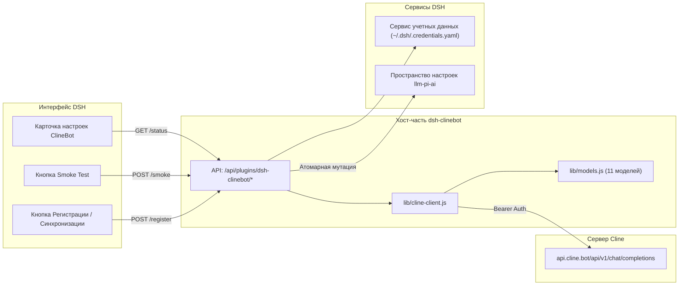

# 📦 @goodandready/dsh-clinebot

<div align="center">

<h3>Нативное подключение провайдера ClineBot / ClinePass для DeepSeek Harness</h3>

<p align="center">
  <a href="https://www.npmjs.com/package/@goodandready/dsh-clinebot"></a>
  <a href="LICENSE"></a>
  <a href="https://github.com/topics/dsh-plugin"></a>
  <a href="https://nodejs.org"></a>
</p>

<!-- Обязательная кнопка перехода на витрину всех проектов -->
<p align="center">
  <a href="https://goodandready.app/"></a>
</p>

<p align="center">
  <a href="README.md"><b>🇬🇧 English</b></a> •
  <a href="README.ru.md"><b>🇷🇺 Русский</b></a> •
  <a href="README.zh.md"><b>🇨🇳 中文说明</b></a>
</p>

</div>

---

## ⚡ Обзор и решаемая проблема

**ClinePass** (`https://cline.bot`) — популярный сервис единой фиксированной подписки (\$9.99/мес), предоставляющий разработчикам повышенные лимиты (в 2–5 раз выше стандартных) на передовые open-weights модели программирования и рассуждений через единый OpenAI-совместимый интерфейс (`https://api.cline.bot/api/v1`).

При попытке подключить ClinePass в DeepSeek Harness (DSH) напрямую возникают сложности:
1. **Отсутствие автодискавери `/v1/models`**: Запрос `GET /v1/models` на сервере `api.cline.bot` возвращает `404 Not Found`. Стандартные механизмы поиска моделей завершаются ошибкой или оставляют список моделей пустым.
2. **Особый формат идентификаторов**: Модели сервиса требуют обязательного системного префикса `cline-pass/` (например, `cline-pass/deepseek-v4-flash`, `cline-pass/kimi-k3`).
3. **Безопасность ключей**: Хранение API-ключей в открытом виде в настройках интерфейса запрещено политикой безопасности DSH.

Плагин **`@goodandready/dsh-clinebot`** решает эти задачи «из коробки»:
* 🎯 Поставляет официальный курируемый каталог из 11 моделей ClinePass.
* 🔐 Безопасно связывает ключ через системный сервис `credentials` DSH (`~/.dsh/.credentials.yaml`) без утечки секрета в настройки.
* 🔄 Регистрация провайдера в реестре моделей DSH (`llm-pi-ai`) в один клик.
* 🩺 Встроенная проверка сетевой задержки и запуск проверочного Smoke-запроса прямо из карточки настроек.

---

## 🏛️ Архитектура



---

## ✨ Возможности и устройство модулей

* **`lib/models.js`**:
  Хранит список моделей ClinePass с параметрами контекста (200k токенов), лимитами генерации и модальностями ввода (`text`, `vision`).
* **`lib/cline-client.js`**:
  Нормализует базовые URL-адреса, формирует конфигурационный объект для реестра `llm-pi-ai` (`api: 'openai-completions'`), выполняет сетевую диагностику и быстрый non-streaming smoke-запрос (`max_tokens: 8`) для замера задержки.
* **`lib/index.js`**:
  Cordis-сервис плагина, запрашивающий сервисы `['settings', 'webServer', 'credentials']`, управляющий конфигурацией и маршрутами API.
* **`lib/client.js`**:
  Браузерный интерфейс без сборки (zero-build), монтируемый в слоты `settings.plugin.item` и `settings.section`. Включает бейджи статуса, чекбоксы активации конкретных моделей и превью ответа Smoke Test.

---

## 📦 Быстрая установка

Установка плагина в активный профиль DeepSeek Harness:

```bash
dsh plugin --profile web add @goodandready/dsh-clinebot
```

Либо для локальной разработки:
```bash
pnpm add /path/to/dsh-clinebot
```

---

## 🔑 Настройка API-ключа

Добавьте ваш ключ ClinePass в файл учётных данных DSH (`~/.dsh/.credentials.yaml`):

```yaml
CLINEBOT_API_KEY: "ваш-ключ-clinepass"
```

Либо задайте его в переменной окружения:
```bash
export CLINEBOT_API_KEY="ваш-ключ-clinepass"
```

---

## ⚙️ Таблица конфигурации (`settings.yaml`)

```yaml
dsh-clinebot:
  enabled: true
  baseUrl: https://api.cline.bot/api/v1
  apiKeyEnv: CLINEBOT_API_KEY
  defaultModel: cline-pass/deepseek-v4-flash
  timeoutMs: 15000
  smokeTimeoutMs: 25000
  enabledModels:
    - cline-pass/deepseek-v4-flash
    - cline-pass/deepseek-v4-pro
    - cline-pass/glm-5.2
    - cline-pass/kimi-k3
    - cline-pass/kimi-k2.7-code
    - cline-pass/kimi-k2.6
    - cline-pass/qwen3.7-max
    - cline-pass/qwen3.7-plus
    - cline-pass/minimax-m3
    - cline-pass/mimo-v2.5
    - cline-pass/mimo-v2.5-pro
```

| Параметр | Тип | По умолчанию | Описание |
|---|---|---|---|
| `enabled` | `boolean` | `true` | Включение/отключение работы плагина. |
| `baseUrl` | `string` | `https://api.cline.bot/api/v1` | Базовый URL API ClinePass. |
| `apiKeyEnv` | `string` | `CLINEBOT_API_KEY` | Имя переменной/учетной записи (сам ключ сюда не пишется). |
| `defaultModel` | `string` | `cline-pass/deepseek-v4-flash` | Модель по умолчанию для проверок и первого старта. |
| `enabledModels` | `string[]` | *Все 11 моделей* | Список моделей, доступных для выбора в DSH. |
| `timeoutMs` | `number` | `15000` | Таймаут сетевой проверки (мс). |
| `smokeTimeoutMs`| `number` | `25000` | Таймаут тестового Smoke-запроса (мс). |

---

## 🔌 Спецификация HTTP API

Маршруты плагина регистрируются по префиксу `/api/plugins/dsh-clinebot`:

* **`GET /status`**: Возвращает статус хоста, наличие ключа в хранилище и список моделей.
* **`POST /register`**: Регистрирует или обновляет провайдера в реестре `llm-pi-ai` DSH.
* **`POST /unregister`**: Удаляет запись провайдера из настроек DSH.
* **`POST /smoke`**: Запускает проверочный запрос и возвращает задержку ответа и текст превью.
* **`POST /models`**: Сохраняет обновленный список включенных моделей.

---

## 📄 Лицензия

MIT © [GooDAnDReaDY](https://github.com/GooDAnDReaDY)
