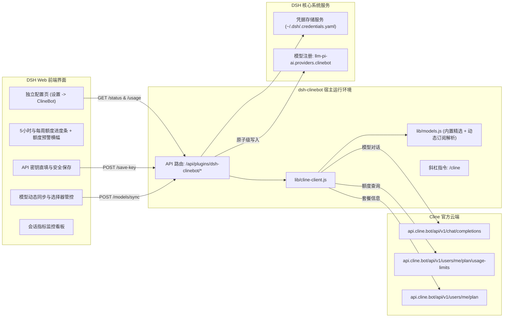

# 📦 @goodandready/dsh-clinebot

<div align="center">

<h3>适用于 DeepSeek Harness 的 ClineBot / ClinePass 原生模型提供商伴侣插件</h3>

<p align="center">
  <a href="https://www.npmjs.com/package/@goodandready/dsh-clinebot"></a>
  <a href="../LICENSE"></a>
  <a href="https://github.com/topics/dsh-plugin"></a>
  <a href="https://nodejs.org"></a>
</p>

<!-- 作者所有项目展示页面链接 -->
<p align="center">
  <a href="https://goodandready.app/"></a>
</p>

<p align="center">
  <a href="README.md"><b>🇬🇧 English</b></a> •
  <a href="README.ru.md"><b>🇷🇺 Русский</b></a> •
  <a href="README.zh.md"><b>🇨🇳 中文说明</b></a>
</p>

<table align="center">
  <tr>
    <td align="center">
      ⭐ <strong>如果您喜欢这个插件，请在 GitHub 上为它点亮 Star</strong> — 这能让我知道插件对您有用，并鼓励我继续开发和维护它。
      <br><br>
      🐛 <strong>如果您发现 Bug 或希望增加功能</strong>，请使用任意语言在 GitHub 上提交 Issue — 我会评估您的建议，并在后续版本中实现有价值的改进。
    </td>
  </tr>
</table>

</div>

---

## ⚡ 概述与解决的核心痛点

**ClinePass** (`https://cline.bot`) 是一项固定月费（\$9.99/月）的高性价比订阅服务，为开发者提供主流开源代码模型与推理模型 2–5 倍的高并发调用限额，统一通过 OpenAI 兼容接口 (`https://api.cline.bot/api/v1`) 提供服务。

在将 ClinePass 接入 DeepSeek Harness (DSH) 时存在以下挑战：
1. **缺失 `/v1/models` 接口**：`api.cline.bot` 的 `GET /v1/models` 会直接返回 `404 Not Found`，导致动态模型同步失败或模型列表为空。
2. **专属模型前缀**：所有模型 ID 均需前缀 `cline-pass/`（如 `cline-pass/deepseek-v4-flash`, `cline-pass/kimi-k3`）。
3. **用量额度监控**：5 小时滑动窗口与每周限额需要清晰直观的可视化进度监控。
4. **安全凭据隔离**：禁止在明文配置中直接填写密钥。

**`@goodandready/dsh-clinebot`** 完美解决以上痛点：
* 🚀 **应用内一键更新**：直接在 DSH 界面检查并升级插件，或通过受保护的 `/dsh-clinebot/update` 进行本地安全更新。
* ⚡ **SWR 配额与健康状态缓存**：状态查询毫秒级响应（<2ms），并在后台静默更新，不阻塞前端渲染。
* 🔀 **智能配额故障转移 (Smart Failover)**：多账号池自动轮询，避开耗尽账号并在 `resetsAt` 到达后自动恢复。
* 🖥️ **插件配置页**：打开已安装的 ClineBot，进入配置。页面包含凭据名、模型、配额和账号，不单独占用侧边栏。
* 🔄 **订阅模型动态同步**：从官方 `GET /api/v1/users/me/plan` 自动提取真实包含模型，一键原子级同步至 DSH 提供商配置，无需等待插件更新。
* ⚠️ **额度耗尽实时预警**：当 5 小时滑动窗口达到 80%（警告黄色）和 95%（即将耗尽红色）时展示醒目预警横幅与重置倒计时。
* 📈 **会话统计与指标看板**：实时追踪请求调用次数、预估 Token（Prompt / Completion）、最近延迟及最后调用时间。
* 📊 **实时用量仪表盘**：调用官方 `GET /users/me/plan/usage-limits` API，实时渲染 5 小时与每周额度进度条及重置倒计时。
* 🔑 **界面直存密钥**：在 UI 中直接粘贴 API 密钥，通过 `ctx.credentials.set()` 自动安全保存至 `~/.dsh/.credentials.yaml`。
* 🎯 **模型选择器管理**：支持勾选开启/关闭特定模型在聊天选择器中的显示。
* 💬 **聊天斜杠指令 `/cline`**：在任意聊天框快速查询当前配额、预警横幅、会话指标统计、网络延迟与活跃模型。

---

## 🏛️ 架构设计



---

## ✨ 核心模块与功能

* **`lib/models.js`**：管理 11 款官方精选内置模型（提供完整的 `Off` / `Low` / `Medium` / `High` / `Max` 思考强度映射、上游 200k 上下文容量标注）以及套餐模型动态解析器（`parsePlanIncludedModels`, `getAllModels`, `getDynamicModels`）。
* **`lib/cline-client.js`**：
  * `fetchUsageLimits`：高效并发轮询 `GET /users/me/plan/usage-limits`、`GET /users/me/plan` 与 `GET /users/me` 并进行内存缓存。
  * `sessionStats` / `recordSessionRequest`：内存级会话度量记录器（请求次数、Token 估算、延迟、时间戳）。
  * `saveCredentialKey`：将密钥安全写入 `~/.dsh/.credentials.yaml`。
  * `smokeChat`：毫秒级网络探活与非流式延迟测试，并记录会话指标。
  * `buildPiAiProvider`：构建 DSH `llm-pi-ai` 兼容的服务商定义 (`api: 'openai-completions'`)。
* **`lib/index.js`**：Cordis 插件主生命周期服务，注册后端 REST API 路由（含 `/dsh-clinebot/models/sync`）、额度预警计算与 `/cline` 聊天斜杠指令。
* **`lib/client.js`**：插件行配置页（`plugins.row.config`），含预警横幅、会话指标、一键模型同步，以及后备插件卡片（`settings.plugin.item`）。没有 `settings.section` 侧边栏项。

---

## 📦 快速安装

在 DeepSeek Harness Web 配置中安装：

```bash
dsh plugin --profile web add @goodandready/dsh-clinebot
```

重启 DeepSeek Harness 实例并刷新浏览器页面。

---

## 💬 聊天斜杠指令 `/cline`

在任何聊天会话中输入 `/cline` 即可即时检查配额、预警状态与会话指标：

```text
### 🤖 ClinePass Status (ClinePass ($9.99/mo))
* 响应延迟: ✅ 210 ms
* 活跃密钥: CLINEBOT_API_KEY (credentials)
* 默认模型: `cline-pass/deepseek-v4-flash`

⏱ 5 小时窗口: [████░░░░░░] 42% (重置时间: 18:00)
📅 每周窗口:   [██████░░░░] 60% (重置时间: 09月08日)
* 绑定账号: `developer@example.com`

📈 当前会话统计:
* 请求次数: 14 次
* Token 估算: ~8,450 (Prompt: 6,100 | Completion: 2,350)
* 最近延迟: 210 ms
```

---

## ⚙️ 配置项参考 (`settings.yaml`)

```yaml
dsh-clinebot:
  enabled: true
  baseUrl: https://api.cline.bot/api/v1
  apiKeyEnv: CLINEBOT_API_KEY
  defaultModel: cline-pass/deepseek-v4-flash
  timeoutMs: 15000
  smokeTimeoutMs: 25000
  enabledModels:
    - cline-pass/deepseek-v4-flash
    - cline-pass/deepseek-v4-pro
    - cline-pass/kimi-k3
    - cline-pass/qwen3.7-max
  dynamicModels: []
```

### 配置参数说明

| 参数项 | 类型 | 默认值 | 说明 |
|:---|:---|:---|:---|
| `enabled` | `boolean` | `true` | 是否启用 ClineBot 桥接插件 |
| `baseUrl` | `string` | `"https://api.cline.bot/api/v1"` | ClinePass OpenAI 兼容接口地址 |
| `apiKeyEnv` | `string` | `"CLINEBOT_API_KEY"` | 凭据管理系统中的密钥名称 |
| `defaultModel` | `string` | `"cline-pass/deepseek-v4-flash"` | 默认选中的模型 ID |
| `timeoutMs` | `number` | `15000` | HTTP 请求超时时间（毫秒） |
| `smokeTimeoutMs` | `number` | `25000` | 探活测试超时时间（毫秒） |
| `enabledModels` | `array` | `[...]` | 允许在聊天下拉框中显示的可用模型列表 |
| `dynamicModels` | `array` | `[]` | 从官方套餐中自动同步的动态模型列表 |

---

## 🧪 测试

运行自动化测试套件：

```bash
npm test
```

---

## 📄 许可证

MIT © [GooDAnDReaDY](https://github.com/GooDAnDReaDY)
