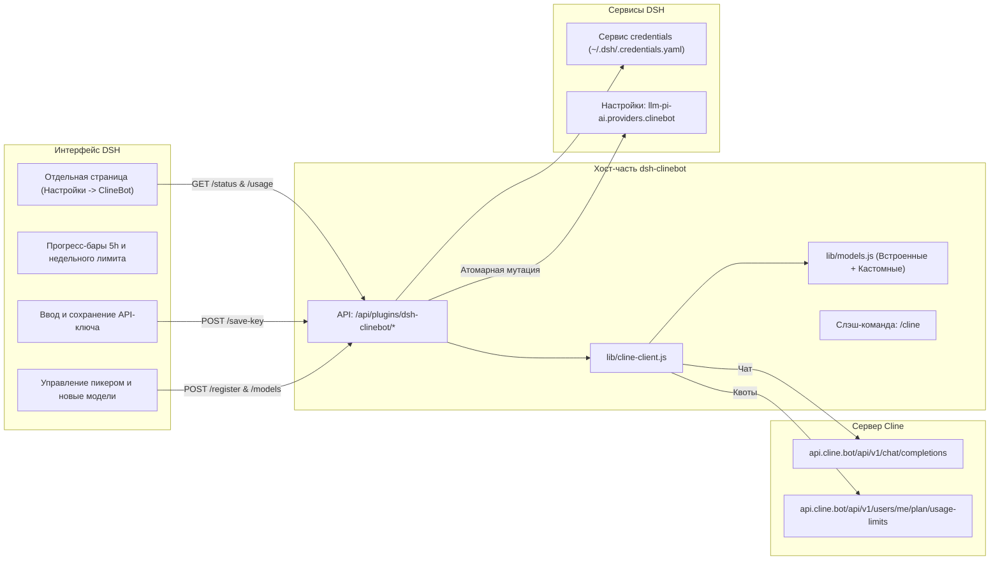

# 📦 @goodandready/dsh-clinebot

<div align="center">

<h3>Нативное подключение провайдера ClineBot / ClinePass для DeepSeek Harness</h3>

<p align="center">
  <a href="https://www.npmjs.com/package/@goodandready/dsh-clinebot"></a>
  <a href="../LICENSE"></a>
  <a href="https://github.com/topics/dsh-plugin"></a>
  <a href="https://nodejs.org"></a>
</p>

<!-- Обязательная кнопка перехода на витрину всех проектов -->
<p align="center">
  <a href="https://goodandready.app/"></a>
</p>

<p align="center">
  <a href="../README.md"><b>🇬🇧 English</b></a> •
  <a href="README.ru.md"><b>🇷🇺 Русский</b></a> •
  <a href="README.zh.md"><b>🇨🇳 中文说明</b></a>
</p>

</div>

---

## ⚡ Обзор и решаемая проблема

**ClinePass** (`https://cline.bot`) — сервис единой фиксированной подписки (\$9.99/мес), предоставляющий разработчикам повышенные лимиты (в 2–5 раз выше стандартных) на передовые open-weights модели программирования и рассуждений через единый OpenAI-совместимый интерфейс (`https://api.cline.bot/api/v1`).

Интеграция ClinePass в DeepSeek Harness (DSH) напрямую сопряжена со следующими сложностями:
1. **Отсутствие эндпоинта `/v1/models`**: запрос `GET /v1/models` к `api.cline.bot` возвращает `404 Not Found`, из-за чего динамический поиск моделей в DSH падает или оставляет список пустым.
2. **Специфический формат идентификаторов**: моделям требуется обязательный префикс `cline-pass/` (например, `cline-pass/deepseek-v4-flash`, `cline-pass/kimi-k3`).
3. **Отслеживание лимитов**: 5-часовые и недельные скользящие окна расхода токенов требуют прозрачной визуализации в интерфейсе.
4. **Безопасность ключей**: хранение API-токенов в открытых конфигурациях небезопасно.

Плагин **`@goodandready/dsh-clinebot`** решает эти задачи «из коробки»:
* 🖥️ **Отдельная страница в Настройках**: собственная полноэкранная страница в меню Настроек DSH (`Настройки → ClineBot`).
* 📊 **Дашборд лимитов подписки (Usage)**: наглядные прогресс-бары расхода 5-часового и недельного скользящего окна из официального API `GET /users/me/plan/usage-limits` с таймером сброса.
* 🔑 **Сохранение ключа прямо из UI**: поле ввода ключа с маскировкой; сохранение напрямую в системный сервис `credentials` (`~/.dsh/.credentials.yaml`) без ручной правки файлов на сервере.
* 🎯 **Управление моделями в пикере**: включение/выключение отображения конкретных моделей в диалогах чата.
* ➕ **Добавление кастомных моделей**: форма добавления новых моделей подписки (ID, имя, контекст, Vision) без необходимости ждать обновления плагина.
* 💬 **Слэш-команда `/cline` в чате**: просмотр остатка квот, задержки и активной модели прямо из чата.

---

## 🏛️ Архитектура



---

## ✨ Структура модулей и возможности

* **`lib/models.js`**: каталог встроенных моделей ClinePass (11 моделей) и управление пользовательскими моделями (`getAllModels`, `validateCustomModel`).
* **`lib/cline-client.js`**:
  * `fetchUsageLimits`: опрос `GET /users/me/plan/usage-limits` и `GET /users/me` с кэшированием в памяти.
  * `saveCredentialKey`: атомарная запись ключей в `~/.dsh/.credentials.yaml`.
  * `smokeChat`: замер задержки и тестовый пинг.
  * `buildPiAiProvider`: генерация конфигурации провайдера для `llm-pi-ai` (`api: 'openai-completions'`).
* **`lib/index.js`**: сервис Cordis, регистрация системных маршрутов и слэш-команды `/cline`.
* **`lib/client.js`**: полнофункциональный раздел настроек (`settings.section`, order 28) и аккордеон плагина (`settings.plugin.item`).

---

## 📦 Установка

```bash
dsh plugin --profile web add @goodandready/dsh-clinebot
```

Перезапустите экземпляр DeepSeek Harness и обновите вкладку в браузере.

---

## 💬 Слэш-команда `/cline` в чате

В любой сессии чата введите команду `/cline` для проверки остатка лимитов:

```text
### 🤖 ClinePass Status (ClinePass ($9.99/mo))
* Пинг хоста: ✅ 210 мс
* Активный ключ: CLINEBOT_API_KEY (credentials)
* Модель по умолчанию: `cline-pass/deepseek-v4-flash`

⏱ 5-часовое окно: [████░░░░░░] 42% (сброс: 18:00)
📅 Недельное окно: [██████░░░░] 60% (сброс: 08.09)
* Аккаунт: `developer@example.com`
```

---

## ⚙️ Таблица конфигурации (`settings.yaml`)

```yaml
dsh-clinebot:
  enabled: true
  baseUrl: https://api.cline.bot/api/v1
  apiKeyEnv: CLINEBOT_API_KEY
  defaultModel: cline-pass/deepseek-v4-flash
  timeoutMs: 15000
  smokeTimeoutMs: 25000
  enabledModels:
    - cline-pass/deepseek-v4-flash
    - cline-pass/deepseek-v4-pro
    - cline-pass/kimi-k3
    - cline-pass/qwen3.7-max
  customModels: []
```

### Параметры конфигурации

| Параметр | Тип | По умолчанию | Описание |
|:---|:---|:---|:---|
| `enabled` | `boolean` | `true` | Включение моста провайдера ClineBot |
| `baseUrl` | `string` | `"https://api.cline.bot/api/v1"` | Базовый URL OpenAI-совместимого API ClinePass |
| `apiKeyEnv` | `string` | `"CLINEBOT_API_KEY"` | Имя переменной / ключа в хранилище credentials |
| `defaultModel` | `string` | `"cline-pass/deepseek-v4-flash"` | Модель, выбираемая по умолчанию |
| `timeoutMs` | `number` | `15000` | Таймаут HTTP-запросов (мс) |
| `smokeTimeoutMs` | `number` | `25000` | Таймаут тестового пинга (мс) |
| `enabledModels` | `array` | `[...]` | Список моделей, активных в селекторе чата |
| `customModels` | `array` | `[]` | Пользовательские модели, добавленные через интерфейс |

---

## 🧪 Тестирование

Запуск автоматического набора тестов:

```bash
npm test
```

---

## 📄 Лицензия

MIT © [GooDAnDReaDY](https://github.com/GooDAnDReaDY)
