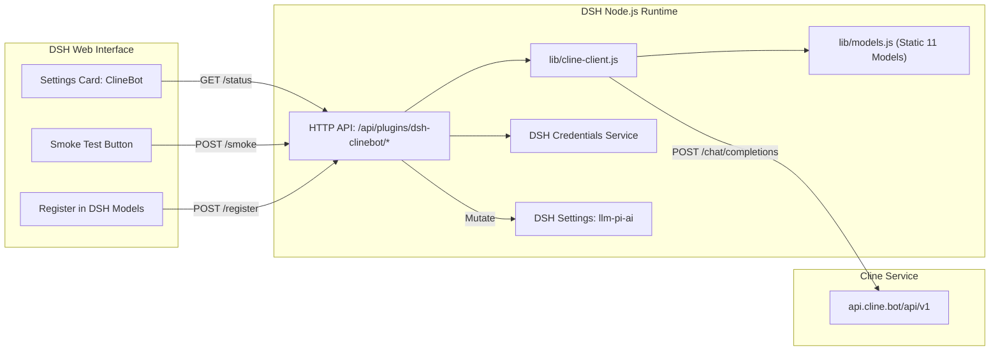

# Design Contract: `@goodandready/dsh-clinebot`

## 1. Executive Summary
`@goodandready/dsh-clinebot` is a companion plugin for DeepSeek Harness (DSH) enabling native integration of the **ClineBot / ClinePass** subscription provider. Because ClinePass is an OpenAI-compatible endpoint whose `GET /v1/models` returns `404 Not Found`, dynamic discovery is impossible. This plugin acts as the bridge: delivering a curated catalog of open-weights models, securely resolving credentials, exposing health and smoke tests, and mutating the DSH `llm-pi-ai` provider registry.

## 2. Architecture & Cordis Lifecycles
The plugin consists of two runtime boundaries conforming to DSH authoring standards:

### 2.1 Host Runtime (`lib/index.js`, `lib/cline-client.js`, `lib/models.js`, `lib/http.js`)
* **Cordis Service Registration**: Injects `['settings', 'webServer', 'credentials']`.
* **Credential Isolation**: The plugin NEVER stores plain API keys in its configuration. The setting `apiKeyEnv` holds the credential identifier (default: `CLINEBOT_API_KEY`), resolved via `ctx.credentials.resolve()` or `process.env`.
* **State Synchronization & Auto-Registration**: Mutates the core `llm-pi-ai` settings space (`op: 'set', path: ['providers', 'clinebot']`) declaratively and automatically when enabled or key is saved.
* **Auto-Discovery & `disabledModels`**: Features automatic background polling of subscription plan models (`GET /api/v1/users/me/plan`). User preferences are tracked via `disabledModels: []`, ensuring newly added plan models appear enabled by default in the DSH chat picker without manual re-synchronization.

### 2.2 Client Runtime (`lib/client.js`)
* Self-registering module via `window.__ModuleLoader__.load({ id: '@goodandready/dsh-clinebot', factory })`.
* Injects `['slots', 'locale', 'settingsScope']`.
* Slots into `settings.plugin.item` (primary) with `key: NS` and `locale: NS`, and graceful fallback to `settings.section` if not declared.
* Registers localized `en` and `ru` dictionaries via `ctx.locale.register()`.
* Reactive binding via `ctx.settingsScope.bind({ namespace: NS })` with `useSyncExternalStore` guarding against `unavailable` / `loading` snapshot states.
* Uses native design tokens (`--dsw-alias-...`) with full dark/light theme support.
* Injects isolated style tag tagged with `data-dsh-plugin="dsh-clinebot"`.

## 3. UI/UX Contract
* **Badges**:
  * Host connectivity: `Host online (<ms>)` (green) / `Host unreachable` (red).
  * Credential presence: `Key ✓ (credentials|env)` (green) / `Key missing` (amber).
  * Registration status: `DSH Registered` (green) / `Not Registered` (amber).
* **Model Picker**: Interactive checklist of all 11 official models with multi-select and vision capability indicators.
* **Non-destructive actions**: Unregister cleanly removes the provider entry from DSH without touching other providers or configurations.

## 4. Security & Isolation
* CSRF / Cross-site protection: All mutating routes (`/register`, `/unregister`, `/smoke`, `/models`, `/accounts/active`, `/auth/begin`) validate `isTrustedSettingsRequest(req)` (`Sec-Fetch-Site !== 'cross-site'`).
* Body size limits: Request payloads are strictly capped at 256 KB.
* Sensitive credential data is never returned across the HTTP API (only `{ present: boolean, source: string, envName: string }`).

## 5. Multi-Account Pool & Resilient Execution (v0.3.3)
* **Account Pool**: The plugin supports multiple accounts (`accounts: [{ label, apiKeyEnv }]`, `activeAccount`). `resolveActiveAccountKey()` automatically selects the configured active account or falls back to primary `apiKeyEnv`. Account switching (`POST /dsh-clinebot/accounts/active` and `/cline switch <label>`) triggers instant re-registration in `llm-pi-ai` without service restart.
* **Resilient Retry Policy**: HTTP calls to ClinePass utilize `retryWithBackoff()` with exponential delays and jitter to automatically absorb transient 429 rate-limiting events and upstream 5xx errors.
* **Reasoning Effort Support**: Models declaring `reasoningEfforts: ['low', 'medium', 'high', 'max']` expose native thinking controls within the DSH model picker, accompanied by UI badges (`🧠 Reasoning`).
* **Offline Cold-Start Cache**: Discovered plan models are serialized locally to `modelsCachePath` (`~/.dsh/clinebot-models-cache.json`), ensuring models remain immediately available on cold boot even if the upstream network or Cline API is temporarily unavailable.

