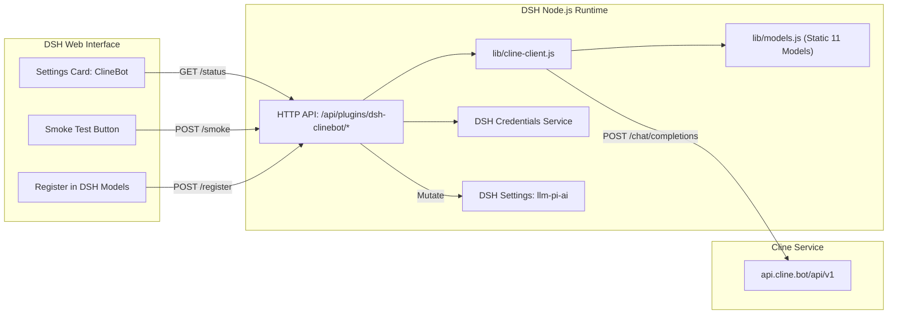

# Design Contract: `@goodandready/dsh-clinebot`

## 1. Executive Summary
`@goodandready/dsh-clinebot` is a companion plugin for DeepSeek Harness (DSH) enabling native integration of the **ClineBot / ClinePass** subscription provider. Because ClinePass is an OpenAI-compatible endpoint whose `GET /v1/models` returns `404 Not Found`, dynamic discovery is impossible. This plugin acts as the bridge: delivering a curated catalog of open-weights models, securely resolving credentials, exposing health and smoke tests, and mutating the DSH `llm-pi-ai` provider registry.

## 2. Architecture & Cordis Lifecycles
The plugin consists of two runtime boundaries conforming to DSH authoring standards:

### 2.1 Host Runtime (`lib/index.js`, `lib/cline-client.js`, `lib/models.js`, `lib/http.js`)
* **Cordis Service Registration & Modern Settings Adapter**: Declares `inject = ['settings', 'webServer', 'credentials']` and integrates with DSH settings via `ctx.inject(['settings'], (sctx) => ...)`. Supports both legacy `sctx.settings.register` and modern DSH 0.1.7+ `SettingsForms` (`svc.replace` / `svc.update` / `svc.describe`). Only user-editable fields are marked `.volatile()`, while `volatileConfig()` strips derived and non-volatile properties prior to DSH settings writes.
* **Safe Service Resolution**: Service lookups utilize defensive proxy resolution `(ctx?.get && ctx.get('credentials')) || ctx?.credentials` to prevent `undefined` properties on Cordis proxies.
* **Credential Isolation**: The plugin NEVER stores plain API keys in its configuration. The setting `apiKeyEnv` holds the credential identifier (default: `CLINEBOT_API_KEY`), resolved via `ctx.get('credentials').resolve()` or `process.env`.
* **State Synchronization & Auto-Registration**: Mutates the core `llm-pi-ai` settings space (`op: 'set', path: ['providers', 'clinebot']`) declaratively and automatically when enabled or key is saved.
* **Auto-Discovery & `disabledModels`**: Features automatic background polling of subscription plan models (`GET /api/v1/users/me/plan`). User preferences are tracked via `disabledModels: []`, ensuring newly added plan models appear enabled by default in the DSH chat picker without manual re-synchronization.

### 2.2 Client Runtime (`lib/client.js`)
* Self-registering module via `window.__ModuleLoader__.load({ id: '@goodandready/dsh-clinebot', factory })`.
* Injects `['slots', 'locale', 'configForms']`. User settings fields are volatile so the host publishes the `dsh-clinebot` namespace; otherwise the page stays on "host namespace is not ready". Nested fields inside those arrays stay plain, and the plugin copies each host volatile reference to a plain value before cloning it. `package.json` `dsh.client.inject` names `@deepseek-ai/dsh-client-ui-slots`, `@deepseek-ai/dsh-client-locale`, and `@deepseek-ai/dsh-client-ui-settings` so those services exist.
* Slots strictly and exclusively into `settings.plugin.item` (`key: NS`, `locale: NS`). Standalone top-level `settings.section` registration is omitted to maintain clean primary navigation in DSH and prevent side-list pollution.
* Opens the namespace with `configForms.get('dsh-clinebot')`. The form exposes `getSnapshot`, `subscribe`, and `set`.
* Registers localized `en` and `zh` dictionaries with duplicate-safe guards (`ctx.locale.register()`), while Russian translation is modularly supplied by `dsh-russian-lang`.
* The settings card reads `ctx.get('configForms').get('dsh-clinebot')`. It does not call `settingsScope`, `lanSettings`, or `bind`. When `configForms` is not yet available, or when running over non-loopback connections (`persistence === 'memory'`), `getSnapshot` returns the frozen fallback constant `SNAPSHOT_READY`, preventing infinite re-render loops in `useSyncExternalStore` (React error #185) and allowing the page to render via its authenticated HTTP REST endpoints without being blocked behind an "unavailable" banner.
* Uses native design tokens (`--dsw-alias-...`) with full dark/light theme support.
* Injects isolated style tag tagged with `data-dsh-plugin="dsh-clinebot"`.

## 3. UI/UX Contract
* **Badges**:
  * Host connectivity: `Host online (<ms>)` (green) / `Host unreachable` (red).
  * Credential presence: `Key ✓ (credentials|env)` (green) / `Key missing` (amber).
  * Registration status: `DSH Registered` (green) / `Not Registered` (amber).
* **Model Picker**: Interactive checklist of all 11 official models with multi-select and vision capability indicators.
* **Non-destructive actions**: Unregister cleanly removes the provider entry from DSH without touching other providers or configurations.

## 4. Security & Isolation
* Same-origin check: mutating routes and the read routes `/status`, `/config`, `/usage`, and `/auth/status` call `isTrustedSettingsRequest`. `/usage` and the status payload return quota fields the card draws (plan, email, window percents) and omit the raw provider body.
* Body size limits: Request payloads are strictly capped at 256 KB.
* Sensitive credential data is never returned across the HTTP API (only `{ present: boolean, source: string, envName: string }`).

## 5. Multi-Account Pool & Resilient Execution (v0.3.3)
* **Account Pool**: The plugin supports multiple accounts (`accounts: [{ label, apiKeyEnv }]`, `activeAccount`). `resolveActiveAccountKey()` automatically selects the configured active account or falls back to primary `apiKeyEnv`. Account switching (`POST /dsh-clinebot/accounts/active` and `/cline switch <label>`) triggers instant re-registration in `llm-pi-ai` without service restart.
* **Resilient Retry Policy**: HTTP calls to ClinePass utilize `retryWithBackoff()` with exponential delays and jitter to automatically absorb transient 429 rate-limiting events and upstream 5xx errors.
* **Reasoning Effort Support**: Models declaring `reasoningEfforts: ['low', 'medium', 'high', 'max']` expose native thinking controls within the DSH model picker, accompanied by UI badges (`🧠 Reasoning`).
* **Offline Cold-Start Cache**: Discovered plan models are serialized locally to `modelsCachePath` (`~/.dsh/clinebot-models-cache.json`), ensuring models remain immediately available on cold boot even if the upstream network or Cline API is temporarily unavailable.

## 6. Performance, Resilience & Telemetry (v0.3.8)
* **Stale-While-Revalidate (SWR) Network Probing**: `probeHealth()` utilizes an in-memory SWR cache (`probeCache`) with 25s TTL. Repeated `/status` queries return instantaneously (<1ms latency) with fresh host availability, asynchronously refreshing network latency in the background without blocking the client UI thread.
* **HTTP Keep-Alive Connection Reuse**: Outbound fetch calls to `api.cline.bot` enforce persistent connection keepalive (`keepalive: true`), eliminating recurrent TLS handshake and TCP connection establishment latency.
* **Auto-Failover Account Rotation**: When an active account encounters HTTP 429 (Rate Limit) or 100% quota depletion, `rotateToNextAccount()` automatically selects the next configured account in the pool, applies the update to DSH settings, and re-synchronizes credentials in `llm-pi-ai` in real time. If writing new settings fails, rotation safely aborts (`rotated: false`) without invalidating quota caches (Resolves #61).
* **Accurate Token Telemetry**: Real usage metadata (`prompt_tokens`, `completion_tokens`, `total_tokens`) is parsed directly from chat completion responses and tracked in session telemetry (`sessionStats`).
* **Expanded Slash Commands**: Slash command `/cline` supports `/cline test [model]` (smoke test with latency, response and token metrics), `/cline ping` (real-time host connectivity test), and `/cline rotate` (round-robin active account rotation).
* **Debounced Model Selection**: Model exclusion checkboxes in `lib/client.js` utilize immediate optimistic UI rendering paired with a 280ms debounced persistence layer, ensuring smooth interaction without request thrashing.

## 7. Stability, SWR Quotas, Smart Failover & One-Click In-App Updater (v0.3.9)
* **SWR Quota Caching (`fetchUsageLimits`)**: In-memory Stale-While-Revalidate caching for Cline usage limits (20s TTL). Returns quota statistics (<2ms) immediately on `/status` requests while refreshing quota windows in the background.
* **Smart Quota-Aware Failover**: Account failover evaluates cached rolling limits (5-hour window), automatically prioritizing accounts with the lowest `percentUsed` and respecting `resetsAt` timestamps for automatic account recovery.
* **One-Click In-App Updater (`/dsh-clinebot/update`)**: Integrates host-side one-click updater (`lib/updater.js`) with security verification (`isTrustedUpdateRequest`: loopback validation, same-origin checks, `x-dsh-plugin-update: 1` header). Allows seamless in-place updates from DSH UI.
* **Canonical DSH Localization Standard**: Source code complies with canonical DSH standards (English base canon, complete Chinese `zh` locale registration in client, external Russian translation provided by `dsh-russian-lang`). All slash command responses and system logs are localized to English.

## 8. Provider Schema Alignment & Security Hardening (v0.3.10)
* **Cordis / Schemastery `reasoningEfforts` Alignment**: `buildPiAiProvider` transforms reasoning effort declarations into strict Cordis schema format (`false | { [key: "off" | "minimal" | "low" | "medium" | "high" | "xhigh" | "max"]: string }`), completely resolving provider loader validation errors (GitHub #1, Gitea #35).
* **ReferenceError Prevention in Localization Fallback**: `lib/client.js` cleanly falls back to English and Chinese dictionaries without referencing undefined locale variables (Gitea #34).
* **Transparent Settings Persistence**: Silent catch blocks eliminated in favor of explicit logging via `ctx.logger.warn` and user-facing error banners in the UI (Gitea #33).
* **Host Updater Prerelease SemVer Support**: `isNewerVersion()` strictly honors SemVer 2.0.0 pre-release specifications, ensuring automated upgrade detection for pre-release and release candidate builds (Gitea #23).
* **Comprehensive Write-Route Origin & Host Validation**: Mutating endpoints rigorously verify `Sec-Fetch-Site`, `Origin`, `Host`, `X-Forwarded-Host`, `Referer`, and loopback IPs against cross-origin forgery while supporting transparent reverse proxies (Gitea #22).

## 9. Packaging Sanitization, Cache Lifecycle & Client Injection Architecture (v0.3.10)
* **Client injection**: `dsh.client.inject` lists the slots, locale, and settings provider packages. The factory `inject` array is `slots`, `locale`, and `configForms`. The factory does not `require()` those packages.
* **Packaging & Public Repository Sanitization**: Internal workflow and deployment files (`AGENTS.md`, `index.md`, `deploy.sh`, `release-notes.md`) are purged from git tracking and permanently blocked via `.gitignore`. Duplicate READMEs in `docs/` are eliminated, trimming npm package unpacked size to ~200 KiB (Resolves #25, #26, #30).
* **Account Switch Cache Invalidation**: Switching or rotating active accounts (`/accounts/active`, `/cline switch`, `rotateToNextAccount`) automatically purges cached rolling quota windows (`clearUsageCache`) and host reachability probes (`clearProbeCache`) to eliminate stale telemetry and immediately revalidate the new account's credentials (Resolves #31). In `rotateToNextAccount`, cache invalidation and `rotated: true` status are strictly gated on successful settings persistence (`settingsApi.replace` / `settings.mutate`); if persistence fails, cache is preserved and `rotated: false` is returned (Resolves #61).
* **Slash-Command Model Validation**: `/cline test [model]` verifies candidate models with `isSupportedModel()` before issuing network requests, providing immediate feedback if an unrecognized model identifier is supplied (Resolves #31).

## 10. UI Theme Compliance, Kernel Icon Fidelity & Module Architecture (v0.3.10)
* **Adaptive Theme Variables & `color-mix` (Resolves #27)**:
  * Eliminated all hardcoded `rgba(...)` and hex color values in `lib/client.js`.
  * All semi-transparent background tints and borders (`.cb-badge-ok`, `.cb-badge-warn`, `.cb-badge-bad`, `.cb-btn-danger`, `.cb-alert-ok`, `.cb-alert-bad`, `.cb-alert-err`, `.cb-banner-warning`, `.cb-banner-exhausted`) strictly utilize CSS `color-mix(in srgb, var(--dsw-alias-state-...) X%, transparent)`.
  * Guarantees 100% legibility, contrast, and visual consistency across both Light and Dark DSH themes.
* **Kernel Chevron Icon Probe & Animated Fallback (Resolves #28)**:
  * Probes official kernel primitives via safe dynamic import: `try { require('@deepseek-ai/dsh-client-ui-primitives') } catch (_) {}` for `IconChevronDownOutline14`.
  * When running on streamlined web profiles where primitives are absent, seamlessly falls back to pixel-perfect SVG `FallbackChevron` (14x14, stroke 1.5, `currentColor`).
  * Card expansion toggle employs canonical class-based rotation: `.cb-chevron` with `transition: transform .16s ease` and `.cb-chevron-open` (`transform: rotate(180deg)`), preserving DSH native micro-interactions.
* **Architectural Boundaries & Module Decomposition (Resolves #29)**:
  * **Browser Bundle (`lib/client.js`)**: Under DSH web profile architecture, client plugins are served directly as single-file self-registering bundles (`window.__ModuleLoader__.load({ id, factory })`) without runtime bundling servers. Splitting client code into unbundled ES modules would break DSH kernel resolution, while introducing runtime bundlers adds unnecessary complexity contrary to `ponytail` minimal engineering standards. Therefore, `lib/client.js` remains a unified runtime artifact, internally organized into distinct domain sections (CSS Theme Tokens, UI Primitives & Chevron, State & Store, Section Components, Entrypoint).
  * **Host Backend Separation (`lib/`)**: Backend responsibilities are decoupled across clean domain boundaries:
    * `lib/http.js`: Common security middleware (`isTrustedSettingsRequest`), stream parsing, and size limit enforcement.
    * `lib/models.js`: Curated model catalog, dynamic discovery parser, active model filtering, disk cache.
    * `lib/updater.js`: SemVer 2.0.0 comparator and host-side one-click plugin updater.
    * `lib/cline-client.js`: ClinePass network client, retry backoff, SWR health probes, token telemetry, Cordis provider builder.
    * `lib/index.js`: Cordis lifecycle, settings registration, `/cline` slash commands, and HTTP route declarations.
