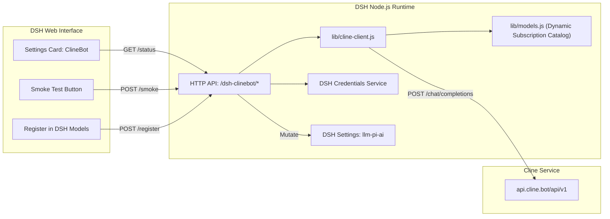

# Design Contract: `@goodandready/dsh-clinebot`

## 1. Executive Summary
`@goodandready/dsh-clinebot` is a companion plugin for DeepSeek Harness (DSH) enabling native integration of the **ClineBot / ClinePass** subscription provider. While ClinePass returns `404 Not Found` on legacy `GET /v1/models`, the plugin discovers active subscription models dynamically via `GET /api/v1/users/me/plan` alongside a curated baseline catalog. The plugin bridges the provider into DSH: securely resolving credentials, synchronizing the provider registry, maintaining session affinity across key rotations, and providing health, smoke, and telemetry inspection.

## 2. Architecture & Cordis Lifecycles
The plugin consists of two runtime boundaries conforming to DSH authoring standards:

### 2.1 Host Runtime (`lib/index.js`, `lib/cline-client.js`, `lib/models.js`, `lib/http.js`)
* **Cordis Service Registration & Modern Settings Adapter**: Declares `inject = ['webServer', 'credentials']`, adapting to DSH 0.1.7+ where the legacy Cordis `settings` service was removed. Uses a lightweight direct `settingsApi` adapter (`get`, `replace`, `update`, `watch`) accessing `ctx?.get?.('settings')` defensively with an atomic persistence contract: writes are persisted prior to updating in-memory state, non-writable settings throw explicitly, and live config preserves Volatile boxes and getters. Only user-editable fields are marked `.volatile()`, while `volatileConfig()` strips derived and non-volatile properties prior to DSH settings writes.
* **Safe Service Resolution**: Service lookups utilize defensive proxy resolution `(ctx?.get && ctx.get('credentials')) || ctx?.credentials` to prevent `undefined` properties on Cordis proxies.
* **Credential Isolation**: The plugin NEVER stores plain API keys in its configuration. The setting `apiKeyEnv` holds the credential identifier (default: `CLINEBOT_API_KEY`), resolved via `ctx.get('credentials').resolve()` or `process.env`.
* **State Synchronization & Auto-Registration**: Mutates the core `llm-pi-ai` settings space (`op: 'set', path: ['providers', 'clinebot']`) declaratively and automatically when enabled or key is saved.
* **Auto-Discovery & `disabledModels`**: Discovers subscription plan models (`GET /api/v1/users/me/plan`) on plugin startup (staggered timers at 500ms and 3000ms), during provider synchronization, and upon explicit trigger (`POST /dsh-clinebot/models/sync`). When upstream is unavailable, cached disk snapshots serve as offline fallback (`planSynced: false`). User preferences are tracked via `disabledModels: []`, ensuring newly discovered plan models appear enabled by default in the DSH chat picker without manual re-synchronization.

### 2.2 Client Runtime (`lib/client.js`)
* Self-registering module via `window.__ModuleLoader__.load({ id: '@goodandready/dsh-clinebot', factory })`.
* Injects `['slots', 'locale', 'configForms']`. User settings fields are volatile so the host publishes the `dsh-clinebot` namespace; otherwise the page stays on "host namespace is not ready". Nested fields inside those arrays stay plain, and the plugin copies each host volatile reference to a plain value before cloning it. `package.json` `dsh.client.inject` names `@deepseek-ai/dsh-client-ui-slots`, `@deepseek-ai/dsh-client-locale`, and `@deepseek-ai/dsh-client-ui-settings` so those services exist.
* **Four Registered UI Seats (`src/client/entry.js`)**:
  1. `plugins.item` (`id: NS, order: 60, label: () => 'clinebot', locale: NS`): Renders inside the DSH Plugins catalog list. Handles `view: 'summary'` (compact one-liner with subtitle) and `view: 'page'` (full embedded settings card).
  2. `plugins.row.config` (`key: '@goodandready/dsh-clinebot#dsh-clinebot'`): Row configuration seat for current DSH core versions keyed by `<package>#<row-id>`.
  3. `plugins.row.config` (`key: 'dsh-clinebot#dsh-clinebot'`): Row configuration seat for short bundle name fallback. Both keys are registered safely; the unused key remains inert.
  4. `settings.plugin.item` (`key: NS, locale: NS`): Standard DSH plugin settings seat for direct plugin configuration display.
  Standalone top-level `settings.section` registration is intentionally omitted to maintain clean primary navigation in DSH and prevent side-list pollution.
* Opens the namespace with `configForms.get('dsh-clinebot')`. The form exposes `getSnapshot`, `subscribe`, and `set`.
* Registers localized `en` and `zh` dictionaries with duplicate-safe guards (`ctx.locale.register()`), while Russian translation is modularly supplied by `dsh-russian-lang`.
* The settings card reads `ctx.get('configForms').get('dsh-clinebot')`. It does not call `settingsScope`, `lanSettings`, or `bind`. When `configForms` is not yet available, or when running over non-loopback connections (`persistence === 'memory'`), `getSnapshot` returns the frozen fallback constant `SNAPSHOT_READY`, preventing infinite re-render loops in `useSyncExternalStore` (React error #185) and allowing the page to render via its authenticated HTTP REST endpoints without being blocked behind an "unavailable" banner.
* Uses native design tokens (`--dsw-alias-...`) with full dark/light theme support.
* Injects isolated style tag tagged with `data-dsh-plugin="dsh-clinebot"`.

```mermaid
graph LR
    subgraph Client [DSH Web Interface]
        UI[Settings Card: ClineBot]
        SmokeBtn[Smoke Test Button]
        RegBtn[Register in DSH Models]
    end

    subgraph Host [DSH Node.js Runtime]
        API["HTTP API: /dsh-clinebot/*"]
        ClientHelper["lib/cline-client.js"]
        Catalog["lib/models.js (Dynamic Subscription Catalog)"]
        CredService[DSH Credentials Service]
        PiAiSettings["DSH Settings: llm-pi-ai"]
    end

    subgraph Remote [Cline Service]
        ClineAPI["api.cline.bot/api/v1"]
    end

    UI -->|GET /status| API
    SmokeBtn -->|POST /smoke| API
    RegBtn -->|POST /register| API
    API --> CredService
    API --> ClientHelper
    ClientHelper --> Catalog
    API -->|Mutate| PiAiSettings
    ClientHelper -->|POST /chat/completions| ClineAPI
```

## 3. UI/UX Contract
* **Badges**:
  * Host connectivity: `Host online (<ms>)` (green) / `Host unreachable` (red).
  * Credential presence: `Key ✓ (credentials|env)` (green) / `Key missing` (amber).
  * Registration status: `DSH Registered` (green) / `Not Registered` (amber).
* **Dynamic Model Picker**: Dynamic checklist synchronized with active ClinePass subscription plan (`GET /api/v1/users/me/plan`), supporting `disabledModels` filtering, custom gateway models (`customModels`), vision indicators, and granular reasoning effort selectors.
* **Non-destructive actions**: Unregister cleanly removes the provider entry from DSH without touching other providers or configurations.

## 4. Security & Isolation
* Same-origin check: mutating routes and the read routes `/status`, `/config`, `/usage`, and `/auth/status` call `isTrustedSettingsRequest`. `/usage` and the status payload return quota fields the card draws (plan, email, window percents) and omit the raw provider body.
* Body size limits: Management and settings request payloads (`/dsh-clinebot/*`) are strictly capped at 256 KiB (`MAX_CONTROL_BODY_BYTES`). The loopback inference proxy (`/dsh-clinebot/v1/chat/completions`) accepts payloads up to 64 MiB (`MAX_PROXY_BODY_BYTES = 64 * 1024 * 1024`).
* Sensitive credential data is never returned across the HTTP API (only `{ present: boolean, source: string, envName: string }`).

## 5. Multi-Account Pool & Resilient Execution (v0.3.3)
* **Account Pool**: The plugin supports multiple accounts (`accounts: [{ label, apiKeyEnv }]`, `activeAccount`). `resolveActiveAccountKey()` automatically selects the configured active account or falls back to primary `apiKeyEnv`. Account switching (`POST /dsh-clinebot/accounts/active` and `/cline switch <label>`) triggers instant re-registration in `llm-pi-ai` without service restart.
* **Resilient Retry Policy**: HTTP calls to ClinePass utilize `retryWithBackoff()` with exponential delays and jitter to automatically absorb transient 429 rate-limiting events and upstream 5xx errors.
* **Reasoning Effort Support**: Models declaring `reasoningEfforts: ['low', 'medium', 'high', 'max']` expose native thinking controls within the DSH model picker, accompanied by UI badges (`🧠 Reasoning`).
* **Offline Cold-Start Cache**: Discovered plan models are serialized locally to `modelsCachePath` (`~/.dsh/clinebot-models-cache.json`), ensuring models remain immediately available on cold boot even if the upstream network or Cline API is temporarily unavailable.

## 6. Performance, Resilience & Telemetry (v0.3.8)
* **Stale-While-Revalidate (SWR) Network Probing**: `probeHealth()` utilizes an in-memory SWR cache (`probeCache`) with 25s TTL. Repeated `/status` queries return instantaneously (<1ms latency) with fresh host availability, asynchronously refreshing network latency in the background without blocking the client UI thread.
* **HTTP Keep-Alive Connection Reuse**: Outbound fetch calls to `api.cline.bot` enforce persistent connection keepalive (`keepalive: true`), eliminating recurrent TLS handshake and TCP connection establishment latency.
* **Auto-Failover Account Rotation**: When an active account encounters HTTP 429 (Rate Limit) or 100% quota depletion, `rotateToNextAccount()` automatically selects the next configured account in the pool, applies the update to DSH settings, and re-synchronizes credentials in `llm-pi-ai` in real time. If writing new settings fails, rotation safely aborts (`rotated: false`) without invalidating quota caches (Resolves #61).
* **Accurate Token Telemetry**: Real usage metadata (`prompt_tokens`, `completion_tokens`, `total_tokens`) is parsed directly from chat completion responses and tracked in session telemetry (`sessionStats`).
* **Expanded Slash Commands**: Slash command `/cline` supports `/cline test [model]` (smoke test with latency, response and token metrics), `/cline ping` (real-time host connectivity test), and `/cline rotate` (round-robin active account rotation).
* **Debounced Model Selection**: Model exclusion checkboxes in `lib/client.js` utilize immediate optimistic UI rendering paired with a 280ms debounced persistence layer, ensuring smooth interaction without request thrashing.

## 7. Stability, SWR Quotas, Smart Failover & One-Click In-App Updater (v0.3.9)
* **SWR Quota Caching (`fetchUsageLimits`)**: In-memory Stale-While-Revalidate caching for Cline usage limits (20s TTL). Returns quota statistics (<2ms) immediately on `/status` requests while refreshing quota windows in the background.
* **Smart Quota-Aware Failover**: Account failover evaluates cached rolling limits (5-hour window), automatically prioritizing accounts with the lowest `percentUsed` and respecting `resetsAt` timestamps for automatic account recovery.
* **One-Click In-App Updater (`/dsh-clinebot/update`)**: Integrates host-side one-click updater (`lib/updater.js`) with security verification (`isTrustedUpdateRequest`: loopback validation, same-origin checks, `x-dsh-plugin-update: 1` header). Allows seamless in-place updates from DSH UI.
* **Canonical DSH Localization Standard**: Source code complies with canonical DSH standards (English base canon, complete Chinese `zh` locale registration in client, external Russian translation provided by `dsh-russian-lang`). All slash command responses and system logs are localized to English.

## 8. Provider Schema Alignment & Security Hardening (v0.3.10)
* **Cordis / Schemastery `reasoningEfforts` Alignment**: `buildPiAiProvider` transforms reasoning effort declarations into strict Cordis schema format (`false | { [key: "off" | "minimal" | "low" | "medium" | "high" | "xhigh" | "max"]: string }`), completely resolving provider loader validation errors (GitHub #1, Gitea #35).
* **ReferenceError Prevention in Localization Fallback**: `lib/client.js` cleanly falls back to English and Chinese dictionaries without referencing undefined locale variables (Gitea #34).
* **Transparent Settings Persistence**: Silent catch blocks eliminated in favor of explicit logging via `ctx.logger.warn` and user-facing error banners in the UI (Gitea #33).
* **Host Updater Prerelease SemVer Support**: `isNewerVersion()` strictly honors SemVer 2.0.0 pre-release specifications, ensuring automated upgrade detection for pre-release and release candidate builds (Gitea #23).
* **Comprehensive Write-Route Origin & Host Validation**: Mutating endpoints rigorously verify `Sec-Fetch-Site`, `Origin`, `Host`, `X-Forwarded-Host`, `Referer`, and loopback IPs against cross-origin forgery while supporting transparent reverse proxies (Gitea #22).

## 9. Packaging Sanitization, Cache Lifecycle & Client Injection Architecture (v0.3.10)
* **Client injection**: `dsh.client.inject` lists the slots, locale, and settings provider packages. The factory `inject` array is `slots`, `locale`, and `configForms`. The factory does not `require()` those packages.
* **Packaging & Public Repository Sanitization**: Internal workflow and deployment files (`AGENTS.md`, `index.md`, `deploy.sh`, `release-notes.md`) are purged from git tracking and permanently blocked via `.gitignore`. Duplicate READMEs in `docs/` are eliminated, trimming npm package unpacked size to ~200 KiB (Resolves #25, #26, #30).
* **Account Switch Cache Invalidation**: Switching or rotating active accounts (`/accounts/active`, `/cline switch`, `rotateToNextAccount`) automatically purges cached rolling quota windows (`clearUsageCache`) and host reachability probes (`clearProbeCache`) to eliminate stale telemetry and immediately revalidate the new account's credentials (Resolves #31). In `rotateToNextAccount`, cache invalidation and `rotated: true` status are strictly gated on successful settings persistence (`settingsApi.replace` / `settings.mutate`); if persistence fails, cache is preserved and `rotated: false` is returned (Resolves #61).
* **Slash-Command Model Validation**: `/cline test [model]` verifies candidate models with `isSupportedModel()` before issuing network requests, providing immediate feedback if an unrecognized model identifier is supplied (Resolves #31).

## 10. UI Theme Compliance, Kernel Icon Fidelity & Module Architecture (v0.3.10)
* **Adaptive Theme Variables & `color-mix` (Resolves #27)**:
  * Eliminated all hardcoded `rgba(...)` and hex color values in `lib/client.js`.
  * All semi-transparent background tints and borders (`.cb-badge-ok`, `.cb-badge-warn`, `.cb-badge-bad`, `.cb-btn-danger`, `.cb-alert-ok`, `.cb-alert-bad`, `.cb-alert-err`, `.cb-banner-warning`, `.cb-banner-exhausted`) strictly utilize CSS `color-mix(in srgb, var(--dsw-alias-state-...) X%, transparent)`.
  * Guarantees 100% legibility, contrast, and visual consistency across both Light and Dark DSH themes.
* **Kernel Chevron Icon Probe & Animated Fallback (Resolves #28)**:
  * Probes official kernel primitives via safe dynamic import: `try { require('@deepseek-ai/dsh-client-ui-primitives') } catch (_) {}` for `IconChevronDownOutline14`.
  * When running on streamlined web profiles where primitives are absent, seamlessly falls back to pixel-perfect SVG `FallbackChevron` (14x14, stroke 1.5, `currentColor`).
  * Card expansion toggle employs canonical class-based rotation: `.cb-chevron` with `transition: transform .16s ease` and `.cb-chevron-open` (`transform: rotate(180deg)`), preserving DSH native micro-interactions.
* **Architectural Boundaries & Module Decomposition (Resolves #29)**:
  * **Browser Bundle (`lib/client.js`)**: Under DSH web profile architecture, client plugins are served directly as single-file self-registering bundles (`window.__ModuleLoader__.load({ id, factory })`) without runtime bundling servers. Splitting client code into unbundled ES modules would break DSH kernel resolution, while introducing runtime bundlers adds unnecessary complexity contrary to `ponytail` minimal engineering standards. Therefore, `lib/client.js` remains a unified runtime artifact, internally organized into distinct domain sections (CSS Theme Tokens, UI Primitives & Chevron, State & Store, Section Components, Entrypoint).
  * **Host Backend Separation (`lib/`)**: Backend responsibilities are decoupled across clean domain boundaries:
    * `lib/http.js`: Common security middleware (`isTrustedSettingsRequest`), stream parsing, and size limit enforcement.
    * `lib/models.js`: Curated model catalog, dynamic discovery parser, active model filtering, disk cache.
    * `lib/updater.js`: SemVer 2.0.0 comparator and host-side one-click plugin updater.
    * `lib/cline-client.js`: ClinePass network client, retry backoff, SWR health probes, token telemetry, Cordis provider builder.
    * `lib/index.js`: Cordis lifecycle, settings registration, `/cline` slash commands, and HTTP route declarations.

## 11. Политика маршрутов (Route Security Policy)

Все HTTP-эндпоинты регистрируются через DSH `webServer` под единым префиксом `/dsh-clinebot/` и защищены строгой политикой проверки источника запроса (Origin, Host, Referer, Sec-Fetch-Site, Remote Address).

| Путь | Метод | Проверка источника | Аутентификация / Ограничения | Назначение |
|---|---|---|---|---|
| `/dsh-clinebot/status` | GET | `isTrustedSettingsRequest` | Loopback / Same-Origin / Same-Site | Сводный статус плагина: состояние провайдера, ping, квоты, активная учётная запись. Секреты скрыты. |
| `/dsh-clinebot/config` | GET | `isTrustedSettingsRequest` | Loopback / Same-Origin / Same-Site | Публичная конфигурация: настройки, список аккаунтов (без секретов), переопределения контекста. |
| `/dsh-clinebot/config` | PUT | `isTrustedSettingsRequest` | Loopback / Same-Origin; max 256 KiB | Обновление настроек плагина с синхронизацией в DSH Settings и `llm-pi-ai`. |
| `/dsh-clinebot/usage` | GET | `isTrustedSettingsRequest` | Loopback / Same-Origin / Same-Site | Телеметрия лимитов и скользящего окна запросов активного аккаунта из SWR-кэша. |
| `/dsh-clinebot/accounts` | POST | `isTrustedSettingsRequest` | Loopback / Same-Origin; max 256 KiB | Добавление нового аккаунта в пул с безопасным сохранением ключа в DSH Credentials. |
| `/dsh-clinebot/accounts/active` | POST | `isTrustedSettingsRequest` | Loopback / Same-Origin; max 256 KiB | Переключение активного аккаунта, инвалидация кэшей квот и обновление провайдера. |
| `/dsh-clinebot/accounts/delete` | POST, DELETE | `isTrustedSettingsRequest` | Loopback / Same-Origin; allowlist env; pool check | Удаление аккаунта из пула с валидацией пространства имен и очисткой секрета из Credentials. |
| `/dsh-clinebot/models/toggle` | POST | `isTrustedSettingsRequest` | Loopback / Same-Origin; max 256 KiB | Включение/выключение модели в DSH чате через массив `disabledModels`. |
| `/dsh-clinebot/models/sync` | POST | `isTrustedSettingsRequest` | Loopback / Same-Origin; max 256 KiB | Принудительная синхронизация моделей активного тарифного плана ClinePass. |
| `/dsh-clinebot/models/context` | POST | `isTrustedSettingsRequest` | Loopback / Same-Origin; max 256 KiB | Настройка размера контекста модели (ручной ввод, дефолт провайдера, оригинальный лимит). |
| `/dsh-clinebot/key/verify` | POST | `isTrustedSettingsRequest` | Loopback / Same-Origin; HTTPS enforce | Проверка валидности API-ключа в ClinePass без его сохранения; блокировка небезопасных remote HTTP. |
| `/dsh-clinebot/save-key` | POST | `isTrustedSettingsRequest` | Loopback / Same-Origin; allowlist env | Безопасное сохранение API-ключа в хранилище credentials (~/.dsh/.credentials.yaml). |
| `/dsh-clinebot/smoke` | POST | `isTrustedSettingsRequest` | Loopback / Same-Origin; max 256 KiB | Запуск быстрого тестового инференса с замером задержки первого токена и валидацией модели. |
| `/dsh-clinebot/register` | POST | `isTrustedSettingsRequest` | Loopback / Same-Origin; max 256 KiB | Декларативная регистрация и обновление провайдера ClineBot в `llm-pi-ai`. |
| `/dsh-clinebot/unregister` | POST | `isTrustedSettingsRequest` | Loopback / Same-Origin; max 256 KiB | Удаление регистрации провайдера ClineBot из настроек `llm-pi-ai`. |
| `/dsh-clinebot/v1/chat/completions` | POST | Loopback Only (`isLoopbackAddress`) | Loopback (127.0.0.1, ::1); max 64 MiB | Прозрачный потоковый и нестриминговый OpenAI-совместимый прокси: max 64 MiB, failover при HTTP 429, сессионная липкость с least-used квотами, контроль дедлайнов (`streamIdleTimeoutMs`). |
| `/dsh-clinebot/v1/models` | GET | Loopback Only (`isLoopbackAddress`) | Loopback (127.0.0.1, ::1); 403 otherwise | Каталог активных моделей ClinePass в OpenAI-формате с обязательной loopback-защитой. |
| `/dsh-clinebot/stats` | GET | `isTrustedSettingsRequest` | Loopback / Same-Origin / Same-Site | Сводная персистентная статистика запросов и токенов (~/.dsh/clinebot-stats.json). |
| `/dsh-clinebot/stats/reset` | POST | `isTrustedSettingsRequest` | Loopback / Same-Origin; max 256 KiB | Сброс накопленной статистики использования токенов. |
| `/dsh-clinebot/update` | POST | `isTrustedUpdateRequest` | Loopback only, Same-Origin, Header `x-dsh-plugin-update: 1` | Безопасное инициирование фонового обновления плагина через `dsh plugin update` / `pnpm`. |

## 12. Архитектура версии 0.4.8 (Pack Features)

### 12.1 Transparent Loopback Proxy & Session Routing (`lib/routes/proxy.js`, `lib/session-router.js`, `lib/updater.js`)
* **Loopback Proxy (`/dsh-clinebot/v1`)**: Локальный мост между DSH `llm-pi-ai` и ClinePass. Эндпоинты строго ограничены loopback-интерфейсом (`isLoopbackAddress(req.socket?.remoteAddress)` -> 403 Forbidden). Поддерживает стриминг SSE с отменой вышестоящего потока (`reader.cancel()`) при обрыве связи (#138, #164, #173), нестриминговые запросы с жестким дедлайном чтения тела по `streamIdleTimeoutMs` и возвратом 502/504 при сбоях (#185), дефолтную модель (`cline-pass/deepseek-v4-flash`), отслеживание токенов инференса и прозрачный failover на резервный ключ при HTTP 429 с отменой тела ответа (#167). Лимит тела запроса прокси — 64 МиБ.
* **Sticky Session Least-Used Routing & Bounded Capacity**: При старте новой сессии выбирает аккаунт из пула с наименьшим расходом квоты (`least-used`). Закрепляет аккаунт за сессией (`sessionId`). В нативном DSH транспорте идентификация сессии транслируется через `prompt_cache_key` (`cacheRetention: 'long'` и `supportsLongCacheRetention: true`) и заголовки `x-session-id`/`x-dsh-session-id`, сохраняя закрепление за тем же аккаунтом даже при смене квот. Таблица сессий строго ограничена емкостью `MAX_SESSIONS = 1000`, эвиктируя старые сессии по TTL (`SESSION_TTL_MS = 24h`) и LRU-алгоритму (`pruneSessions`) на всех ветках маршрутизации, включая ручной пин (#163, #183). При 429 или таймаутах аккаунт переводится в кулдаун на 60 секунд.
* **Process Tree Termination & Lockfile Sync in Updater**: При обновлении плагина через `installExact` дочерний процесс запускается с флагом `detached: true` на POSIX, образуя выделенную группу процессов (`PGID`). При таймауте сигнал `SIGTERM` отправляется группе (`-child.pid`). Если после выхода родительского процесса дочерние процессы (leaf) продолжают выполняться, эскалационный таймер сохраняет активность и транслирует `SIGKILL` по всей группе процессов (`-child.pid`), гарантируя полное завершение дерева процессов (#172).

### 12.2 Persistent JSON Analytics (`lib/stats-storage.js`)
* Персистентное хранилище метрик в `~/.dsh/clinebot-stats.json` с автоматической загрузкой при старте плагина (`apply()`).
* Динамическое переключение хранилища (`statsPath`) на лету при нативных обновлениях `loader/volatile-update` и вызовах API: атомарный сброс буфера предыдущего файла и загрузка целевого файла до фиксации новых событий (#158).
* Атомарная запись (`.tmp` + rename) с дебаунсом (500 мс) и синхронным `flushStats` при остановке/выгрузке плагина.
* Агрегация по дням, месяцам, моделям и аккаунтам, фиксация 429 ошибок.
* Автоматическое сохранение диагностической копии (`*.corrupt.<timestamp>`) при повреждении файла статистики.

### 12.3 Reasoning Defaults & Custom Models (`lib/models.js`, `lib/config.js`)
* Дефолтный `reasoning_effort` (`low`, `medium`, `high`, `max`) для reasoning-моделей в конфигурации и UI.
* Поддержка пользовательских моделей (`config.customModels`) с подмешиванием в каталог и DSH chat picker.

### 12.4 Quota UX & Proactive Monitoring
* Человекочитаемый обратный отсчёт (`formatResetCountdown`) для недельных и месячных окон сброса.
* Предупреждающий баннер в UI и статусная индикация `⚠️ < 10%` при критическом остатке квоты.

## 13. Что публикуется (Packaging & Distribution Policy)

Состав пакета строго контролируется декларативным белым списком `files` в `package.json` и правилами `.gitignore`:

### 13.1 Состав npm-пакета (`files`)
* `lib/` — хост-рантайм (`index.js`, `cline-client.js`, `credential-refs.js`, `models.js`, `http.js`, `updater.js`, `session-router.js`, `stats-storage.js`, `routes/`) и собранный бандл клиентского интерфейса (`lib/client.js`).
* `cordis.patch.yml` — cordis patch-конфигурация внедрения плагина.
* `README.md` — каноническая пользовательская документация на английском языке.
* `README.ru.md` — полная пользовательская документация на русском языке.
* `README.zh.md` — полная пользовательская документация на китайском языке.
* `CHANGELOG.md` — история изменений и версий.
* `LICENSE` — лицензия проекта (MIT).
* `media/visual-verification.png` — визуальное свидетельство интерфейса (входит в дистрибутив для отображения в npm/DSH).

### 13.2 Исключения из публикации (npm и Git)
* Исключено из npm: `src/` (исходники UI), `test/` (тесты), `scripts/` (скрипты сборки и релиза), `docs/` (архитектурный контракт `docs/design/DESIGN.md` отслеживается только в репозитории).
* Исключено из Git: `.worktrees/`, `.planning/`, `docs/plans/`, `.dsh-test/`, `node_modules/`, `*.tgz`, `.env*`, `credentials*`, служебные дампы.
* Дата последней проверки состава пакета: **2026-09-27**.

## 14. Testing, Preflight & Release Workflow

### 14.1 Development & Test Execution
* Все работы выполняются только на MiniAI (`192.168.1.111`) в изолированных worktrees: `/mnt/external/Project/DEV/dhsplugins/dsh-clinebot/.worktrees/<branch>`.
* Запуск набора тестов: `npm test` (тесты выполняются с изолированным HOME через `--import ./test/_setup.mjs`).
* Статический и контрактный preflight: `bash ~/.dsh/skills/dsh-plugin-preflight/scripts/preflight.sh .` (обязательное требование: `FAIL=0`).
* Проверка лимитов декомпозиции (`test/decomposition.test.js`):
  - Серверные модули: `<= 600` строк.
  - Клиентские модули в `src/client/`: `<= 500` строк.
  - Собранный бандл `lib/client.js`: `<= 262144` байт (`256 KiB`).

### 14.2 Release Gates & Acceptance Environments
1. **Commit & PR**: Conventional Commits с привязкой задач `Refs: #<issue>`. PR в Gitea с полным описанием проблемы, причин, изменений и доказательств проверок.
2. **Изолированный Test Server (MiniPC `192.168.1.123`)**:
   - Сборка неизменяемого `.tgz` кандидата: `npm pack --dry-run --json` (проверка исключения служебных файлов).
   - Передача в `/tmp` MiniPC и установка через `dsh-test-plugin install /tmp/<pkg>.tgz`.
   - Полный цикл проверок: status, Web UI, logs `dsh-test-web.service`, smoke-тесты.
   - Обязательный cleanup тестового контура после завершения проверок.
3. **Предрелизная Production-приёмка**:
   - Временная установка того же проверенного `.tgz` в production DSH profile.
   - Выполнение health/smoke/e2e проверок в реальном контуре.
4. **Авторизация релиза**:
   - Запрос явного подтверждения владельца: "Публикуем релиз? / да - релиз - прод".
   - Только после подтверждения: публикация в публичный npm (`@goodandready/dsh-clinebot`) и GitHub Release с развёрнутыми заметками на EN, ZH, RU.
5. **Финальная фиксация в Production**:
   - Замена временного `.tgz` кандидата точной опубликованной версией из npm registry (`dsh plugin add @goodandready/dsh-clinebot@<version>`).
   - Повторная верификация запуска и логирования.
6. **Обновление витрины**:
   - Актуализация карточки плагина на [goodandready.app](https://goodandready.app/) (версия, описание, ссылки) и деплой сайта.
